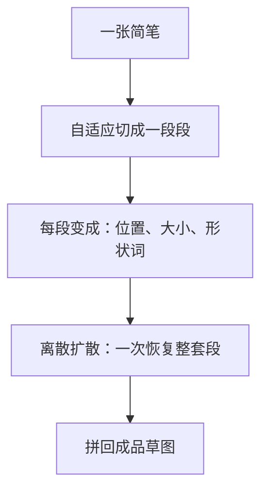
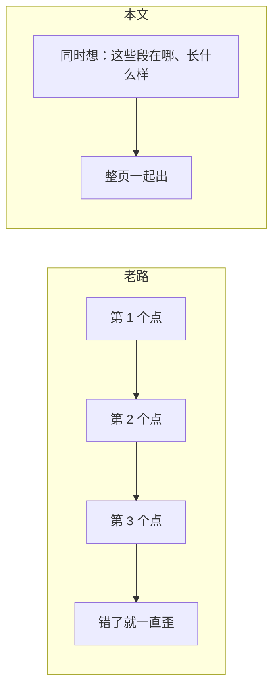

# PDF-Sketch

先看 [[入门-读论文前先看]]。

## 原文 PDF

库里已有 PDF，但本期按计划不读。期刊摘要：[图学学报](http://www.txxb.com.cn/CN/abstract/abstract2560.shtml)。

## 一句话

把草图切成一段段笔画，先变成「离这段线有多远」，再像填词一样一次生成整页布局。少走「一个点接一个点往后画」的路，减少越画越歪。

## 要解决什么问题

整笔折线或一根贝塞尔，不好形容复杂形状。按点的顺序预测，错一点，后面全歪，结构和细节都丢。

## 原理

「离散扩散」可以想成：先把形状收成词典里的词，再像补字游戏一样把整页词猜齐。和「把照片从糊还原」那种连续扩散不是同一套积木，但都叫扩散。

和 [[StrokeFusion]] 同一问题家族：生成**成品**简笔，不是生成作画过程。同一组深大作者的中文配套。

## 算法示意图

## 重要段落精翻

摘要大意：在 QuickDraw 上，FID、Precision、Recall 优于 Sketch-RNN 和 SketchKnitter；少笔画时召回更好，多笔画时结构和整体更稳。

**为什么重要：** 中文期刊把「布局式草图 + 扩散」写清楚了。开题可写：组内已有成品生成，本工作转向过程。不要写成阶段扩散。

## 数据与实验

QuickDraw 简笔。完整表待全文。摘要称少笔画召回更好，多笔画结构更稳——和 StrokeFusion「笔画越多越占优」是同一方向。

## 这些数字对素描意味着什么

1. **又一篇成品简笔扩散，不是过程。**  
   本课题不宜再做「第三篇更好的 QuickDraw 生成」。审稿人会问：和组里两篇差在哪？

2. **切段对石膏像有用。**  
   一只耳朵、一道颧骨，本来就不是一笔折线画到底。过程模型的「一笔」可以是一段，但段的**出现顺序**要按阶段，不能再当无序集合。

3. **中文期刊适合放工程。**  
   切段规则、词典大小、失败例，可以先写在中文刊或附录。顶会论文写过程问题和人的阶段。

## 和本课题的关系

划清：组内会做成品草图。我们做有阶段、可中断的过程。

## 可借鉴

- 笔画段比整笔灵活。
- 开题一句带过即可。

## 局限

- 本期不读全文。
- 仍是 QuickDraw，不是美术素描过程。

## 还要回原文看的

全文实验表和切段图。
