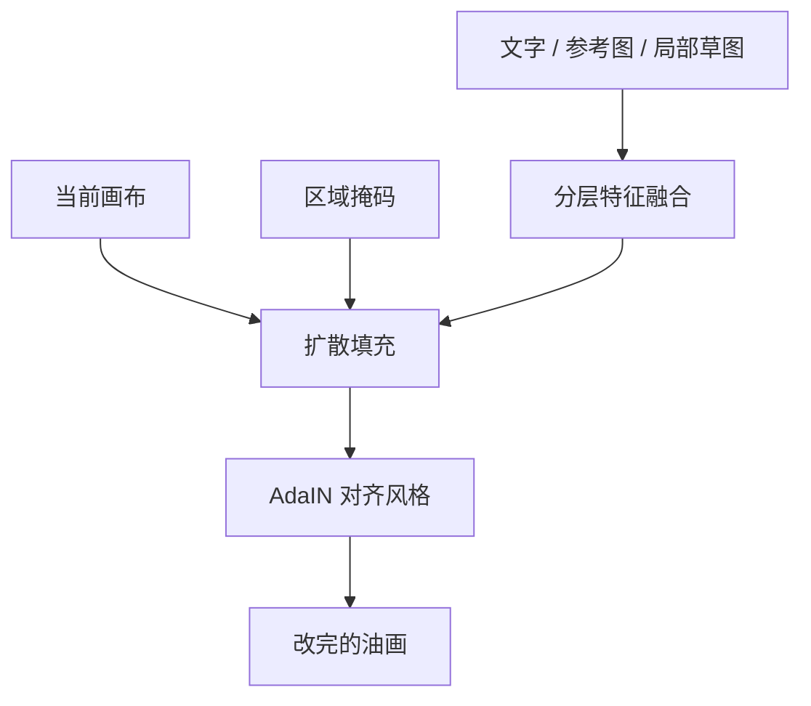

# PaintFlow（交大，交互油画）

先看 [[入门-读论文前先看]]。这篇用到：扩散、消融、FID。

## 原文 PDF

[[PaintFlow-Oil.pdf]]

网上还有另一篇同名 *PaintFlow*，是庆应做阶段感知视频的，见 [[PaintFlow-阶段感知]]。两篇不是同一工作。

## 一句话

在油画的任意阶段、任意区域改画：文字管语义，草图管结构，参考图管内容和外观。

## 要解决什么问题

现有生成和编辑多在照片域。油画笔触一改，风格就散。作者要的不是「生成一段作画视频」，而是「画到一半还能改，而且始终像同一张油画」。

## 原理

训练用油画修复和配对数据，保住笔触纹理。推理用 AdaIN 对齐风格，避免局部一改、整张风对不上。

流程可以拆成：背景铺陈 → 前景按草图落地。空白、半成品、成品都能继续。

## 算法解析

### 输入 / 输出

当前画布 + 要改的掩码 +（文字、参考图、局部草图）→ 填好的油画区域。

### 推理时怎么走

作者写的创作流：背景阶段用文字和参考图定构图；前景阶段再加草图锁结构。每步大约 2 分钟，从零画完大约 8 分钟，单步推理约 5 秒。

采样用 DDIM。三个条件各有模块，缺一个都会掉。

## 重要段落精翻

### 1. 任意阶段（引言附近）

> editing according to user instructions at any stage of the oil painting process (from blank canvas, intermediate stages, or fully finished artwork), and within any specified region.

**精翻：** 按用户指令，在油画过程的任意阶段改（空白、中途或成品），并且可以指定任意区域。

**为什么重要：** 这是第 4 档的问题定义。过程生成解决「能演」，交互编辑解决「能改」。

### 2. 三模态（Table 1 表说）

> Our method features the most comprehensive multimodal input, enabling simultaneous alignment of text, image semantics and style.

**精翻：** 我们的方法输入模态最全，能同时对齐文字、图像语义和风格。

**为什么重要：** 消融表明：去掉文字、语义或风格，FID 和观感都会掉。

## 图在讲什么

| 图 | 在讲什么 |
|---|---|
| Fig. 4 | 四步「流式」画完一张油画。 |
| Fig. 5 | 消融：兔、树、花。去掉语义 / 风格 / 文字，对不上或纹理没了。草图含糊时会和参考图打架。 |

## 数据与实验

因真油画数据少，从 DiffusionDB 等构造配对。指标看文字对齐、图像对齐、Gram 风格、FID、美感。

**Table 1**

| 方法 | CLIP-T↑ | CLIP-I↑ | Gram↑ | FID↓ | Aesthetic↑ |
|---|---|---|---|---|---|
| IP-Adapter+Inpaint | 0.862 | — | 0.568 | 268.16 | 5.098 |
| IP-Adapter+Scribble | 0.834 | 0.792 | 0.431 | 287.50 | 4.873 |
| Paint-by-Example | — | 0.809 | 0.417 | 281.71 | 4.894 |
| MagicQuill | 0.802 | — | 0.585 | 258.35 | 5.147 |
| 本文 | **0.947** | **0.909** | **0.619** | **234.27** | **5.322** |
| 去掉文字 | — | 0.827 | 0.605 | 260.91 | 5.109 |
| 去掉语义 | 0.920 | — | 0.611 | 249.63 | 5.184 |
| 去掉风格 | 0.929 | 0.867 | 0.420 | 279.80 | 5.002 |

另有 35 人排序的用户研究（Table 2，细节见原文）。

## 这些数字对素描意味着什么

1. **三个条件都在，FID 最低（234）；去掉风格，FID 升到 280。**  
   局部一改就散风，油画如此，排线更如此。第 4 篇必须报：改了第 2 阶段结构线之后，第 3 阶段排线方向还一致吗？只报改完的那一块像不像，不够。

2. **去掉文字，图和参考还在，但作者说草图含糊时会和参考打架。**  
   素描交互里，用户乱画一根，模型要听线还是听范画？需要一句阶段指令来拍板：「现在只改结构，别管调子。」

3. **从零大约 8 分钟、单步约 5 秒。**  
   交互论文要报时间。过程扩散可以慢，改一笔必须快。第 4 篇把「秒级局部改」写成卖点。

4. **现在还是预印本。**  
   相关工作当「交互油画」引，不要写成已经发表的 CCF-A。

## 和本课题的关系

油画第四档。素描主论文做成过程扩散后，下一篇可以做：改第 2 阶段结构线，后面跟着改，前面大形尽量不动。

## 可借鉴

- 交互单独成篇，不要塞进第一篇过程生成。
- 草图在这里是控制信号；我们生成的是素描过程，方向相反，但「结构用线来锁」可以共用。
- 相关工作里两篇 PaintFlow 必须分开写。

## 局限

- 仍是预印本，不能按 CCF-A 写。
- 重点是编辑，不是学画家分阶段步骤。
- 输出是油画栅格。

## 还要回原文看的

Fig. 4、Fig. 5，以及特征融合和 AdaIN 的公式。
