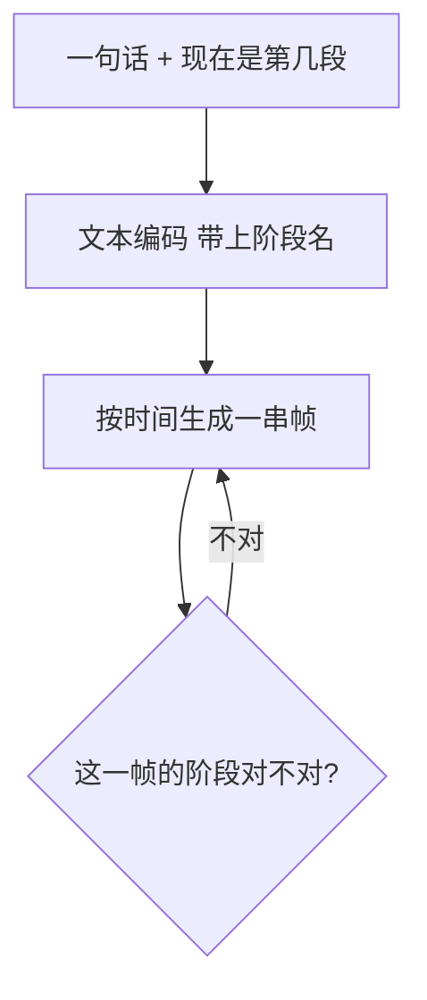

# PaintFlow（庆应，阶段感知）

先看 [[入门-读论文前先看]]。

## 原文 PDF

公开预印本没有找到。下面根据 [项目页](https://lclab.org/projects/paintflow) 和 ICASSP 2026 条目整理。以后若有 PDF，放到 `附件/pdf/PaintFlow-StageAware.pdf`。

另一篇同名是交大做交互改画的，见 [[PaintFlow-交互油画]]。不是同一工作。

## 一句话

把数字绘画过程写成四段，并告诉视频模型「现在是第几段」，再按文字生成作画视频。

## 要解决什么问题

普通文生视频会把作画过程当成「普通小视频」。阶段会乱跳：颜色还没铺就上了光，或线稿和彩稿搅在一起。

作者把阶段写成一等条件，而不是生成完再切片。

## 原理

四段（插画上色流程，不是石膏像素描）：

1. 草稿
2. 线稿
3. 铺色
4. 光影

数据两套：

- 静帧：3000 多张，每张带阶段名
- 视频：约 22400 帧，按帧标阶段

模型里有：带阶段的文字编码、管时间的压缩器、以及一个专门稳住「动作别乱跳阶段」的模块。

## 算法示意图

全文未见，上图是按项目页推的，细节以日后 PDF 为准。

## 重要段落精翻

项目页大意（不是论文逐字）：阶段条件用来同时稳住语义和动作连贯；应用指向美术教学、创作辅助。

**为什么重要：** 「阶段」第一次被写成模型输入，而不只是论文里的形容词。

## 数据与实验

静帧 3000+，动态约 22400 帧。号称阶段对齐和观感好于当时文生视频。没有原文表，数字不在这里编。

## 这些数字对素描意味着什么

1. **四段本身就是贡献。**  
   素描不必抄「铺色、光影」。应对成：构图 / 大形、结构线、排线调子、细节收束。没有阶段标签，后面的扩散很难和「普通视频生成」分开。

2. **先标静帧，再标视频。**  
   石膏像可以先收：同一对象的四张阶段静图。延时录像以后再补。这比空想 294 段全程录像实在。

3. **档次是 CCF-B。**  
   说明「阶段感知」单独拿出来也能发，但还没到 SIGGRAPH 那档。素描若把阶段做成扩散过程，仍可冲更高；相关工作里把这篇放对位置，别夸成 A。

4. **和交大那篇同名，必须分开写。**  
   一篇是任意区域改油画，一篇是四段视频。审稿人搜 PaintFlow 会撞车，你要主动说清。

## 和本课题的关系

阶段要写进模型。数据可以学：静帧阶段 + 过程视频。

## 可借鉴

- 评价加「阶段是否按顺序出现」。
- 第 1 篇论文可以先把阶段和数据立住。

## 局限

- 没读到全文。
- 四段是插画上色，不能直接当素描流程。

## 还要回原文看的

整篇 PDF。有了之后按模板补表、补公式。
