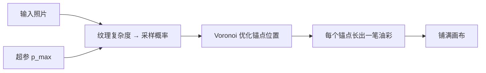

# Im2Oil

先看 [[入门-读论文前先看]]。这篇用到：栅格、用户打分。

## 原文 PDF

[[Im2Oil.pdf]]

## 一句话

按纹理复杂度自适应采笔触锚点，油画细腻度可以用一个概率上限近似线性调节。

## 要解决什么问题

以前的笔画渲染多在最小化像素误差。笔触堆在误差大的地方，不像油画，细腻度也不好调。强化学习方法（Huang 等）结果偏糊；Paint Transformer 笔触偏方、画不满；Zou 等边界有噪点。

作者把油画改写成自适应采样：在哪下锚点，比「像素贴原图」更重要。

## 原理

三件事分开：

1. **局部密度**：纹理复杂处采样更密。
2. **全局数量**：由整体复杂度和 $p_{max}$ 决定一共多少锚点。
3. **位置**：Voronoi 把锚点推开，避免扎堆。

$p_{max}$ 从小到大，成品从概括到细腻，作者称近似线性。

## 算法解析

### 输入 / 输出

照片 → 一叠油画笔触渲染图。不是学真人录像。

### 关键量

- 锚点密度看局部纹理。
- 锚点个数看全局纹理和 $p_{max}$。
- 每笔在锚点附近搜形状、方向、颜色。
- 用 padding 保证画布填满，避免 Paint Transformer 那种黑缝。

过程顺序由采样顺序决定，不是画家步骤。

## 重要段落精翻

### 1. 问题改写（结论）

> we rethink the SBR oil painting problem from the perspective of adaptive stroke anchor sampling rather than the common pixel-wise approximation technique route.

**精翻：** 我们把笔画油画问题改看成自适应锚点采样，而不是常见的逐像素逼近。

**为什么重要：** 油画第 2 档的贡献点：媒介特化 + 细腻度可调。素描对应的是排线疏密，不是油彩。

### 2. 和强化学习比（第 5.1 节）

> The main weakness of this method is that the results are too blurred and lack style since its oil painting agent is trained by minimizing the $L_2$ loss.

**精翻：** 这种方法的主要弱点是结果太糊、缺少风格，因为它的油画智能体用 $L_2$ 损失来训。

**为什么重要：** 像素损失会把「像照片」当成目标，把材质抹掉。

## 图在讲什么

| 图 | 在讲什么 |
|---|---|
| Fig. 8 | 同一张输入：本文两种细腻度，对比 Huang / Liu（Paint Transformer）/ Zou。 |
| 文中采样图 | 复杂纹理锚点密，平坦区域疏。 |

## 数据与实验

画廊 50 张，五类各 10 张：风景、肖像、动物、建筑、静物。115 名志愿者打 MOS，去掉 7 人不靠谱，分数归一化到均值 7.5、方差 1.5。

**Table 1 MOS（越高越好）**

| 方法 | 风景 | 肖像 | 动物 | 建筑 | 静物 | 总均 |
|---|---|---|---|---|---|---|
| Huang et al. | 6.91 | 7.42 | 7.60 | 6.88 | 7.06 | 7.17 |
| Liu et al. | 7.32 | 6.58 | 6.74 | 7.47 | 6.69 | 6.96 |
| Zou et al. | 7.12 | 8.07 | 7.28 | 7.25 | 7.58 | 7.46 |
| 本文 $p_{max}{=}19$ | 7.98 | 7.61 | 7.44 | 7.37 | 7.84 | 7.65 |
| 本文 $p_{max}{=}41$ | **8.46** | **8.27** | **8.20** | **8.03** | **8.34** | **8.26** |

正文里定性对比写的是 $p_{max}=14$ 和 $19$，表里是 $19$ 和 $41$。以表为准。

## 这些数字对素描意味着什么

1. **细腻度从 7.65 到 8.26（同方法，只改一个上限）。**  
   同一个模型，线少和线密应该能调。素描不要训两个无关网络，而要一个「疏密旋钮」。这就是媒介特化那一篇的数字故事。

2. **用户分按风景 / 肖像 / 动物 / 建筑 / 静物分开报。**  
   石膏像、静物、人物素描，难度不同。你的表也该分类，不要一个平均数糊弄。

3. **比的是成品好不好看，不是过程。**  
   采样顺序不是画家步骤。这篇只能证明「材质和疏密值得单独发」。不能当过程基线。

4. **复杂处锚点密，平坦处疏。**  
   排线阶段可以直接借：转折和明暗交界密排，大平面疏排。第 3 阶段的损失可以加「该密不密」的惩罚。

## 和本课题的关系

对应油画「媒介特化」。素描不是油彩，是线、排线、调子。若只做通用草图、不强调素描媒介，贡献会偏弱。

## 可借鉴

- 「细腻度可调」对应素描抽象程度：几笔大形，还是密排线。
- 结构转折处多下笔，大平面少下笔。

## 局限

- 仍是渲染成品，不是学真人过程。
- 采样顺序 ≠ 画家步骤。
- 对素描是对照，不是直接基线。

## 还要回原文看的

Fig. 8 和采样示意图。Voronoi 细节在第 3 节。
