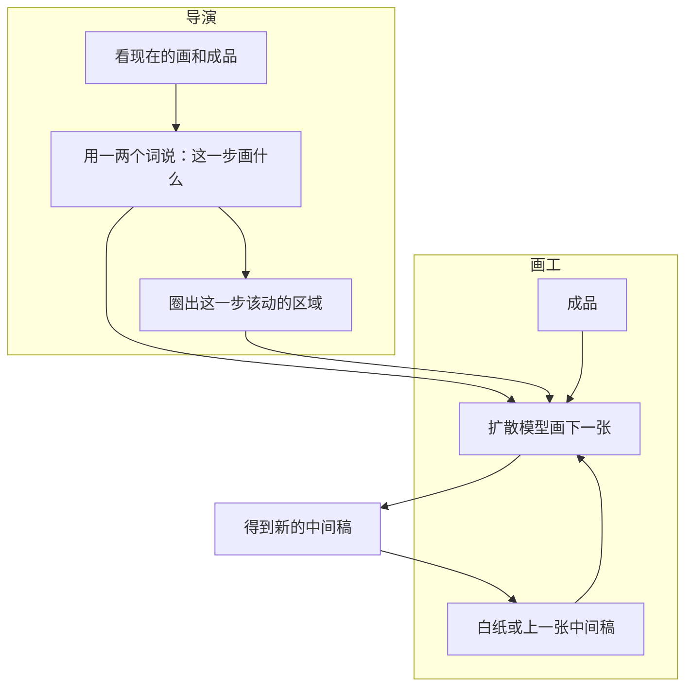
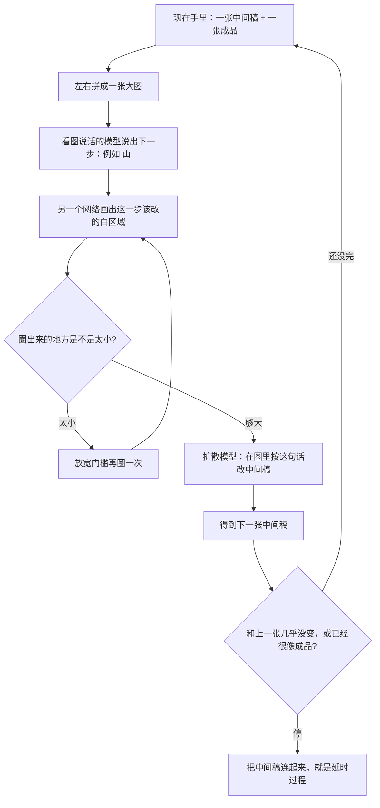
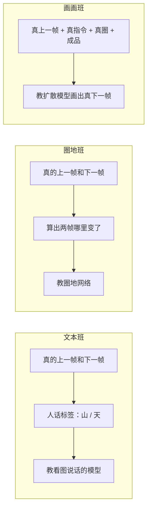

# Inverse Painting

先看 [[入门-读论文前先看]]。这篇用到：[[深度学习]]、[[训练]]、[[推理]]、[[扩散模型]]、[[自回归]]、[[对错怎么量-损失]]、[[LPIPS]]、[[IoU]]、[[FID]]、[[消融]]。

全文译文：[[Inverse-Painting-译文]]。要点：[[Inverse-Painting-要点]]。原文：[[Inverse-Painting.pdf]]。复现见 [[30-复现Inverse-Painting]]。

## 原文 PDF

[[Inverse-Painting.pdf]]

代码在 `复现/inverse_painting`。

## 一句话

给你一张画完的画，模型从白纸开始，一步步往上画，猜它大概是怎么画出来的。

## 要解决什么问题

成品只能看见最后一层颜料。达芬奇画《蒙娜丽莎》画了 16 年，没有延时录像。网上有一些画家自拍的全程视频，但只覆盖世界上极少一部分画。

作者想：先让机器看很多真作画录像，再拿一张没见过的成品，猜出「它大概经历过哪些中间稿」。

以前两条路都不够：

1. [[Learning-to-Paint]]、[[Paint-Transformer]]：按「由粗到细」的人工规则下笔。最后一张只是大约像，中间步骤不像人。
2. 更早的 Timecraft：学过真录像，但只在 50×50 的小方块上做，看不见整幅画在画什么。

作者改问：对着整张成品，从白纸更新到完成。每一步先想「画什么、画哪里」，再动笔。

## 原理

真人画家常见习惯：从后往前（先天空后山）、一次只盯一块地方、分层上色（先铺底再加高光）。

作者试过更笨的办法：把「现在的画」和「成品」塞进一个网络，直接吐下一张。结果有两种糟：

- 一步加太多，不像慢慢画。
- 山的绿底还没铺完，黄高光就先出来了。

所以拆成两个动作，不要让一个网络既当导演又当画工。

可以把它想成辅导学生临摹：

1. 老师先说：「先画山和天。」
2. 老师再指：「动上面这一块，别动树。」
3. 学生只改被指到的地方。
4. 改完再看，下一句可能是：「继续画山。」

仓库自带的例子里，白纸下一步的标准答案就是 `Mountain, sky`（山、天），再下一步是 `Mountain`（山）。

三个小模型分开教。教的时候给标准指令；真正用的时候，指令也由模型自己说。

## 算法示意图

论文 Fig. 3 是总图，字多、箭头多。下面两张是我按代码和正文重画的。

### 用的时候：一步里发生什么

最多走 50 步。每步大约对应录像里 20 秒。

### 教的时候：三个班分开上课

圈地的「标准答案」不是人拿鼠标描的。计算机比较相邻两帧，人眼觉得哪里变了，哪里就涂白。这叫感知差异图。

画画班的主干是现成的文生图扩散模型（稳定扩散）。作者又加了几块零件：

- **成品注入**：让网络随时看见最终要画成什么样。
- **当前稿注入**：别把已经画好的地方毁掉。
- **时间**：告诉它「这一步只该加一点点，还是可以加一块」。
- **下一帧的图意**：用「图和字对过齐的模型」猜下一帧大概在讲什么，当作额外提示。

## 算法解析

### 进什么、出什么

| 人话 | 是什么 |
|---|---|
| 成品 | 用户丢进来的那张画完的图 |
| 第 0 张 | 纯白画布 |
| 后面每一张 | 模型猜的中间稿 |
| 时间间隔 | 相邻两张中间稿，对应录像里大约 20 秒 |
| 短指令 | 一两个英文词，笔记里译成「天 / 山 / 细节」 |
| 圈 | 这一步允许改的区域，像选区 |

### 训练（教）

1. **文本班**：把「现在」和「成品」左右拼好，问：下一步该画什么，不超过两个词。标准答案来自真录像的相邻帧。
2. **圈地班**：标准圈 = 相邻真帧的感知差异。网络要学会：看见现在的画、成品和那句话，圈对地方。
3. **画画班**：给它对的上一帧、对的话、对的圈、成品，让它画出真的下一帧。

### 推理（用）

对应官方 `demo.py`：

1. 拼图，让看图说话的模型吐词。
2. 圈地。圈太小就降低门槛再圈。
3. 扩散模型画出下一张。
4. 比较「这一张和上一张差多少」「这一张和成品差多少」。几乎不动了，或已经很像成品，就停。

### 机器怎样知道自己错了

- 画画班：把真下一帧弄糊，让网络猜「糊之前是什么样」。猜错就改参数。
- 圈地班：圈出来的白区和「两帧真实变化」对不齐，就改参数。
- 停止：相邻两步几乎一样，或离成品已经很近。具体门槛在代码里，复现时再对。

## 重要段落精翻

### 1. 任务定义（第 1 节）

> We formulate this as an autoregressive image generation problem, in which an initially blank “canvas” is iteratively updated. The model learns from real artists by training on many painting videos.

**精翻：** 我们把这件事写成「自己吃自己的输出」的图像生成：从空白画布开始，按当前状态反复更新。模型靠大量作画视频，向真画家学。

**为什么重要：** 输出是一条时间线，不是一张成品。和 [[StrokeFusion]]「一次倒出全部笔画」正好相反。

### 2. 为什么不能只预测像素（第 1 节）

> we’ve found that a purely pixel-based approach struggles to produce reasonable results in practice, and thus we incorporate additional semantic analysis.

**精翻：** 我们实际发现，只在颜色格子上预测下一帧，很难画出合理过程，所以要加上「画的是什么」这种理解。

**为什么重要：** 这是拆成「导演 + 画工」的直接理由。素描里的阶段名（大形、结构、排线）就顶这里的短指令。

### 3. 画家习惯（第 1 节）

> The resulting videos resemble how human artists typically paint, for example, from back to front, focusing on semantic objects or regions at a time, and employing layering techniques.

**精翻：** 生成的视频像人在画：从后往前，一次盯一块有意义的区域，并且分层上色。

**为什么重要：** 以后写素描过程，评价也可以对这三条：顺序像不像、一次是否只改一块、有没有先铺后收。

### 4. 只加时间还不够（第 3.1 节）

> When Δt is included … the new content volume per update is better controlled; however, this approach still results in unnatural rendering of mountains, as the yellow layers prematurely appear before the completion of the green mountain base.

**精翻：** 加上时间间隔后，每步加多少比较可控。但山还是画得不像：绿底没铺完，黄高光就先出来了。

**为什么重要：** 时间只能管「加多少」，管不了「先加哪一层」。顺序要靠那句人话和那个圈。

## 论文原图在讲什么

库里画的是我重画的流程。论文原图仍建议对着 PDF 看一眼：

| 原图 | 看什么 |
|---|---|
| Fig. 1 | 两张成品，各抽 10 张中间稿。下面那张偏梵高，训练里并没有这种风。 |
| Fig. 2 | 真画家：天 → 云 → 山 → 其余。 |
| Fig. 3 | 官方总图。绿箭头出词，橙箭头出圈，蓝箭头画画。 |
| Fig. 5 | 拆零件之后的失败样子。 |
| Fig. 6 | 词和圈叠在帧上。后面几步可以连续三帧都写「细节」，但圈不同地方。 |
| Fig. 8 | 和别人比。有的方法天上冒红块，有的在格子里同时下笔。 |

## 原图裁图

从 PDF 新裁的 5 张。图说见 [[Inverse-Painting-译文]]。

### Fig. 1 成品和过程

![[图/Inverse-Painting/fig1-teaser.png]]

上排丙烯风景，下排梵高风夜景。左边是输入成品，右边各抽 10 张中间稿。

### Fig. 3 方法总图

![[图/Inverse-Painting/fig3-overview.png]]

左：出词和出圈。中：扩散画工。右：用的时候绿箭头出词，橙箭头出圈，蓝箭头画画。

### Fig. 5 拆零件

![[图/Inverse-Painting/fig5-ablation.png]]

同一座山。(b) 一步加太多。(d) 有字没圈，整座山一次画完。(e) 有圈没字，绿湖先冒出来。(f) 先铺山顶的绿。

### Fig. 8 和别人比

![[图/Inverse-Painting/fig8-compare.png]]

SVD 天上冒红块，树干被截断。Paint Transformer 在格子里同时下笔。Timecraft 一直很糊。

### Fig. 11 人像失败

![[图/Inverse-Painting/fig11-failure.png]]

风景模型画男像：先是团块，再是没有五官的头肩，最后一格才有脸。

## 数据与实验

**他们用了什么录像**

| 项 | 数字 | 人话 |
|---|---|---|
| 视频 | 294 段 | 丙烯风景，有人在画 |
| 时长 | 平均约 9 分钟 | 常常是加速过的 |
| 划分 | 265 段用来教，29 段用来考 | 考的不能在教的里面 |
| 每幅平均 | 27 张关键帧 | 不是每一帧录像都留 |
| 相邻间隔 | 教的时候约 23.6 秒 | 考的时候默认按 20 秒一跳 |
| 帧对 | 教 7261 对，考 783 对 | 一对 = 上一张 + 下一张 |

预处理：切出画布，把手、笔、几乎没变的帧扔掉。

**考卷怎么打分（Table 1，越该好的方向已标明）**

| 方法 | 和真过程有多像 ↓ | 改的地方对不对 ↑ | 靠近成品的曲线差 ↓ | 总时长差（分钟）↓ | 画面味道差 ↓ |
|---|---|---|---|---|---|
| Paint Transformer | 0.643 | 0.104 | 94.61 | 6.057 | 337.3 |
| Timecraft | 0.602 | 0.251 | 153.2 | 9.964 | 289.8 |
| 视频扩散微调 | 0.500 | 0.197 | 135.5 | 8.577 | 168.3 |
| 本文 | **0.364** | **0.418** | **32.66** | **1.273** | **150.6** |

表里英文原名依次是 LPIPS、IoU、DDC、DTS、FID。见 [[入门-读论文前先看]]。

拆零件之后：

- 词和圈都拿掉：改的地方最乱（重叠大约只剩 0.14）。
- 只拿掉圈：重叠大约 0.18，区域仍对不齐。
- 只拿掉时间：总时长和靠近成品的节奏对不齐。
- 画面味道主要靠「成品注入」那一块。

33 个人看 8 张没训练过的画，给过程打 1～5 分。本文大约是视频扩散的 1.9 倍、Paint Transformer 的 2.1 倍、Timecraft 的 3.0 倍。

## 这些数字对素描意味着什么

先把结论说死：**油画上「指令 + 圈地 + 再画」是成立的。素描不能照抄他们的尺子，更不能照抄丙烯风景数据。**

1. **IoU 从 0.10 拉到 0.42。**  
   意思是：告诉模型「一次只改一块」，它真的会改得更像人。素描里这块对应「这一步只排脸颊，别去改眼睛轮廓」。你的实验也该报「这一步改的区域对不对」，不要只报最后一张漂不漂亮。

2. **Paint Transformer 最后也能画出大约像的画，但重叠只有 0.10。**  
   由粗到细的人工规则，会被过程指标打脸。开题时可以说：只学「把图画满」不够，要学「每次动哪里」。

3. **FID 最低的是本文，但不是最该抄的数。**  
   FID 只说画面味道接近训练录像。石膏像素描和丙烯风景味道本来就不同。你若只追 FID，模型可能学会「画出一张像训练集的风景油画」，而不是「画出合理的素描步骤」。

4. **用户分差了大约 2～3 倍。**  
   真人一眼能看出「像不像在画」。素描更该做这种小题：给老师或同学看四段过程，问哪段像课堂示范。20～30 人就够写进论文。

5. **数据只有 294 段，还全是风景丙烯。**  
   素描没有同等规模的「从起稿到调子」录像。不要幻想一上来 300 段石膏像延时。更现实的是：先给成品素描标四段阶段，或从「撤销历史」还原中间稿。这正是 [[ProcessPainter]] 用假过程预训练、真过程少量微调的理由。

6. **输出是一串 JPG，不是能改的线。**  
   素描用户要能擦一根结构线。栅格过程只能当演示视频。主论文若对标这篇，贡献要写成：同样是反推过程，但中间量是线和阶段，不是色块。

7. **官方推理太重。**  
   同时挂一个会看图说话的大模型和一个扩散模型。学方法不必复现 28 GB。素描第一版可以用人手写「第 2 步：结构线」，先把画工网络跑通。

## 和本课题的关系

素描很适合做反过程：用户丢来一张石膏像素描，模型还原它可能是怎么画出来的。成品素描多，过程录像少，正好用反推补数据。

配方借「先出指令、再改一块」。指令不要一上来用英文大模型。用四个中文阶段名就够：构图 / 大形、结构线、排线调子、细节收束。

## 可借鉴

- 导演和画工分开，好写贡献，也好做消融。
- 教的时候给标准指令，考的时候用预测指令。
- 过程尺子：改哪、节奏、像不像人。最后一张好看只是其中一项。
- 和 [[ProcessPainter]] 成对引用：一篇往前画，一篇往回推。

## 局限

- 训练全是丙烯风景，线稿素描没验证。
- 中间稿不能当矢量编辑。
- 一步错、后面容易一直错。
- 显存和磁盘都很重，见 [[30-复现Inverse-Painting]]。

## 还要回原文看的

Fig. 3、Fig. 6、Fig. 8。其余数字和流程以这篇笔记为准。
