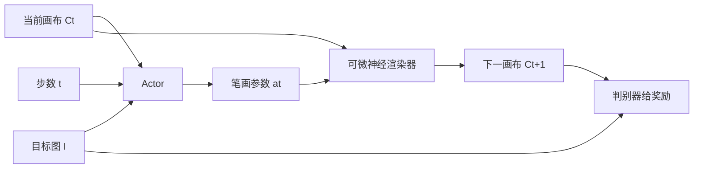

# Learning to Paint

先看 [[00-目录]]。这篇会用到：[[强化学习]]、[[演员与评论家]]、[[状态-动作-奖励]]、[[折扣]]、[[可微渲染器]]、[[对抗与判别器]]、[[像素差-L2]]、[[训练]]、[[推理]]。

全文译文：[[Learning-to-Paint-译文]]。要点：[[Learning-to-Paint-要点]]。原文：[[Learning-to-Paint.pdf]]。演示：https://youtu.be/YmOgKZ5oipk

## 原文 PDF

[[Learning-to-Paint.pdf]]

## 一句话

用强化学习把目标图拆成有序笔触：每步输出笔画参数，可微渲染器画到画布上。

## 要解决什么问题

人能用很少的笔画概括一张复杂图。机器要学这件事，但没有「标准笔画序列」当监督。逐步贪心只看当前误差，不会为后面留位置。

作者把作画写成马尔可夫决策：状态是当前画布、目标图、剩余步数；动作是连续笔画参数；奖励是这一步让画布更接近目标多少。

## 原理

三点关键：

1. 奖励看整段累计，不看单笔局部最优。用 model-based DDPG。
2. 动作是连续的：位置、形状、颜色、透明度。
3. 渲染器是神经网络，可反传，所以 Actor 能拿到环境梯度。作者称之为 model-based DDPG：环境被显式建模，不必让 Critic 暗学环境。

另外用 Action Bundle：一步预测 $k$ 笔再按序画上，类似强化学习里的 frame skip。

## 算法解析（每个符号点开基础知识）

### 进什么、出什么

- 进：目标图 $I$（一张[[栅格图]]）、白画布 $C_0$、总步数 $n$
- 出：一串动作 $a_0,\ldots,a_{n-1}$，以及画完的 $C_n$
- 一步里的状态 $s_t = (C_t, I, t)$，见 [[状态-动作-奖励]]

### [[推理]]（用，不再改参数）

1. [[演员与评论家|演员]]看见现在的画布、目标、第几步。
2. 吐出动作 $a_t$：这一笔的位置、形状、颜色、透明度。
3. [[可微渲染器]]把笔落到画布上，得到 $C_{t+1}$。
4. 重复 $n$ 次。

用的时候不要评论家。评论家只在[[训练]]里帮忙。

### [[训练]]（教）

[[演员与评论家|评论家]]估「从这张画布往后还能拿多少分」：

$$V(s_t) = r(s_t, a_t) + \gamma V(s_{t+1})$$

- $r$：这一步的[[状态-动作-奖励|奖励]]
- $\gamma$：[[折扣]]
- $V(s_{t+1})$：下一步那张画还值多少

演员要让这件事变大：

$$r(s_t, \pi(s_t)) + V(\mathrm{trans}(s_t, \pi(s_t)))$$

- $\pi$：演员自己，看见状态就出动作
- $trans$：[[可微渲染器]]。必须[[可微]]，[[梯度]]才能从「画得不像」传回演员的[[数字和参数|参数]]
- 后面那个 $V$：评论家对新画布的打分

### 奖励这一行在说什么

$$r(s_t,a_t) = L_t - L_{t+1}$$

$L$ 是「现在的画」和「目标」差多远。这一笔之后差距变小，$r$ 就是正的。

$L$ 不用死板的[[像素差-L2]]，而用[[对抗与判别器]]的分数。人话：鉴定师觉得更像真画了，就给分。

整段目标：$\sum_i \gamma^{i-t} r_i$。从现在到画完，每一步分按远近打[[折扣]]再加起来。所以演员不能只贪眼前一笔。

一步里预测 $k$ 笔再按序画上，叫 Action Bundle，类似玩游戏时隔几帧再看屏幕。为的是一次探索更大的动作组合。

### 论文里各数据集用多少笔

| 数据 | 笔画数 | 人话 |
|---|---|---|
| MNIST（手写数字） | 5 | 很简单 |
| SVHN（门牌号） | 40 | |
| CelebA（人脸） | 200 | |
| ImageNet（各类照片） | 400 | 图越杂，笔越多 |

这些笔数只说明「贴原图要多少笔」，不说明先画大形。

## 重要段落精翻

### 1. 为什么用强化学习（第 1 节）

> RL can maximize the cumulative rewards of a whole painting process rather than the gain of current stroke.

**精翻：** 强化学习能最大化整段作画的累计奖励，而不是只看当前这一笔赚了多少。

**为什么重要：** 这是「过程可以当科研问题」的起点。但奖励仍是像素/判别器差，不是「像不像人」。

### 2. 状态定义（第 3.2 节）

> Formally, $s_t=(C_t,I,t)$. … the step number $t$ acts as additional information to instruct the agent the remaining number of steps.

**精翻：** 状态是当前画布、目标图和步数。步数告诉智能体还剩几步。

**为什么重要：** 后面扩散过程模型也常要时间或剩余步数，否则不知道该铺大块还是收细节。

### 3. 没有真人数据（摘要）

> The training process does not require the experience of human painters or stroke tracking data.

**精翻：** 训练不需要画家经验，也不需要笔画追踪数据。

**为什么重要：** 这是优点，也是上限：学不到从后往前、一次一块区域。[[Inverse-Painting]] 后来专门补这块。

## 图在讲什么

![[图/Learning-to-Paint/fig1-process.png]]

Fig. 1：左列目标，后面是过程。作者说由粗到细。数字 `3`、人脸、鸟都是先铺色块，再慢慢像。这是贴照片的规划，不是课堂步骤。三问的展开见[[Learning-to-Paint-译文]]。

![[图/Learning-to-Paint/fig2-arch.png]]

Fig. 2：左是推理，演员出参数，渲染器上画布。右是训练，判别器给奖励，评论家估后面的分。

![[图/Learning-to-Paint/fig4-ddpg.png]]

Fig. 4：左是原版 DDPG，评论家要暗学环境。右是这篇，渲染器先画出来，演员才能拿到环境梯度。

| 图 | 在讲什么 |
|---|---|
| Fig. 1 | 过程。先大色块，后细节。不像课堂起稿。 |
| Fig. 2 | 左：推理。右：训练。 |
| Fig. 3 | MNIST / SVHN / CelebA / ImageNet 上，笔画越多越像目标。 |
| Fig. 4 | 原版 DDPG vs 可微环境。 |

## 数据与实验

在 MNIST、SVHN、CelebA、ImageNet 上展示。评价主要是视觉和与目标图的接近程度。没有「像不像人画画」的用户研究。

这是油画第 1 档：证明过程能当问题，步骤仍是机器自己的贪心规划。

## 这些数字对素描意味着什么

1. **笔画数 5 / 40 / 200 / 400，图越来越像目标。**  
   这只证明「多画几笔能贴原图」。不证明先画的是大形。素描若用同样奖励（只看和照片差多少），模型会在五官上堆线，大关系反而乱。

2. **没有真人数据是优点，也是天花板。**  
   开题可以学：第 2 篇先做「能出有序笔画」，不等人标。第 3 篇再上真过程或阶段标签，把顺序纠成人。

3. **奖励是「更接近目标图」。**  
   [[Inverse-Painting]] 后来证明：这种奖励下的过程，人一眼能看出来不像。素描第 2 篇若只报和照片的像素差，第 3 篇的过程指标会把它打下来——这反而能写成递进。

4. **可微渲染对矢量素描有用。**  
   线的控制点能反传，以后排线疏密可以当动作。但动作不要定义成「任意位置下一笔」，要定义成「当前阶段允许的那类线」。

## 和本课题的关系

素描第 2 篇（过程模仿）要对标这篇和 [[Paint-Transformer]]。差别：我们要人的阶段顺序，不是只把误差降下去。

## 可借鉴

- 把作画写成「状态、动作、转移、奖励」。
- 可微渲染让笔画参数能反传。
- 剩余步数作为条件。

## 局限

- 奖励是像目标图，不是像人。
- 笔画是参数化几何，不是真颜料层。
- 几百步自回归，后面会漂。
- 没有阶段标签。

## 还要回原文看的

Fig. 3 的四列结果。Fig. 1、Fig. 2、Fig. 4 已裁进库。公式在第 3 节。
