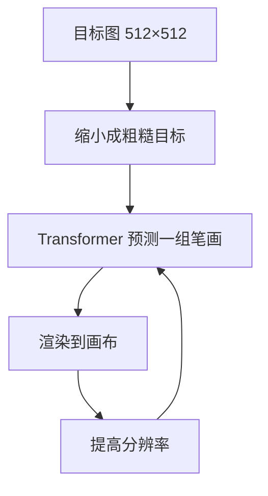

# Paint Transformer

先看 [[入门-读论文前先看]]。这篇用到：前馈、Transformer、自监督。

## 原文 PDF

[[Paint-Transformer.pdf]]

## 一句话

把「下一组笔画」当成集合预测，用 Transformer 一次前馈出多笔，由粗到细画到 512×512。

## 要解决什么问题

强化学习一步一笔，难训、也慢。笔画优化在很大参数空间里搜，更慢。

作者改问：能不能像目标检测那样，一次预测一组笔画参数？没有现成「图–笔画」数据集，就自己合成：随机往画布上画前景笔，让网络把这些笔找回来。

## 原理

由粗到细：先看缩小的目标，预测大笔；再提高分辨率，补小笔。每层在图像块上并行预测 $N$ 笔。

自监督：随机生成背景画布和前景笔画集，渲染出目标图。网络要预测前景笔画。损失同时打在笔画参数和像素上。

换渲染器的笔刷贴图，同一套预测器可以出油画笔、方块、圆点。

## 算法解析

### 输入 / 输出

- 输入：自然图
- 输出：多层笔画集合，渲染成 512×512
- 训练时一块 32×32，每块预测 $N=8$ 笔
- 推理默认 $K=4$ 层由粗到细

### 训练时怎么走

1. 随机笔刷合成背景。
2. 再随机采样前景笔，画到背景上得到目标。
3. 若某笔盖住前一笔超过 60% 面积，标成无效（标签 0），避免全重叠。
4. Transformer 预测参数和置信度。
5. 损失：像素 L1、参数 L1、Wasserstein（管尺度）、置信度 BCE。权重 $\lambda_r{=}8,\ \lambda_{L1}{=}1,\ \lambda_w{=}10,\ \lambda_{bce}{=}1$。
6. Adam，学习率 $10^{-4}$，batch 128，3 万步，单卡 RTX 2080 Ti，不到 4 小时。

### 推理时怎么走

前馈，一组笔画并行，接近实时。不必逐步强化学习。

### 关键量

消融（Fig. 6）：去掉像素损失，颜色和位置乱；去掉参数 L1，形状重复；去掉 Wasserstein，大笔消失；去掉置信度，满图碎小笔。

## 重要段落精翻

### 1. 问题改写成集合预测（摘要）

> we formulate the task as a set prediction problem and propose a novel Transformer-based framework, dubbed Paint Transformer, to predict the parameters of a stroke set with a feed forward network.

**精翻：** 我们把任务写成集合预测，用 Transformer 前馈预测一组笔画参数。

**为什么重要：** 从「序列决策」改成「检测一组物体」。快了，但集合本身不编码真人笔序。

### 2. 人怎么画（第 1 节）

> humans create paintings through a stroke-by-stroke procedure, using brushes from coarse to fine.

**精翻：** 人作画是一笔接一笔，笔刷由粗到细。

**为什么重要：** 作者把「由粗到细」写成手工程序（分辨率金字塔），不是从真视频里学的。[[Inverse-Painting]] 批评的就是这点。

### 3. 没有现成数据（摘要）

> since there is no dataset available for training the Paint Transformer, we devise a self-training pipeline such that it can be trained without any off-the-shelf dataset

**精翻：** 没有现成训练数据，我们设计了自训练流程，不依赖现成数据集。

**为什么重要：** 合成监督只能学「把图画满」，不能学画家习惯。

## 图在讲什么

| 图 | 在讲什么 |
|---|---|
| Fig. 1 | 自然图 → 逐步过程 → 成品。第二行是过程。 |
| Fig. 6 | 四个损失各去掉一项的失败样子。 |
| Fig. 7 | 换笔刷：油彩、方、圆。 |
| Fig. 8 | 先风格迁移再绘画。 |

## 数据与实验

没有真人作画视频。定量：从风景、WikiArt、FFHQ 各抽 100 张，报像素损失和感知损失（越低越像原图）。效率：单卡 2080 Ti 上，推理明显快于优化方法，也略快于强化学习方法。训练不到 4 小时。

[[ProcessPainter]] Table 1 后来用同一任务衡量：Paint Transformer 最后一帧 LPIPS 0.153，远差于过程扩散的 0.025。[[Inverse-Painting]] Table 1 里它的 IoU 只有 0.104，说明每次改的区域最不像人。

## 这些数字对素描意味着什么

1. **训练不到 4 小时、推理接近实时。**  
   第 2 篇可以走前馈，先做出「能演示的有序线」，用来答辩和收数据。不必等大扩散。

2. **由粗到细是缩小图像，不是美术阶段。**  
   [[Inverse-Painting]] 里它的区域重叠只有 0.10，是基线里最不像人改地方的。引用时主动写：金字塔 ≠ 构图 / 结构 / 排线。

3. **自合成数据只能教「把图画满」。**  
   随机笔没有「先画头再画脖子」。素描第 2 篇若也自合成，合成规则必须写入阶段：先长线、后短排线。否则第 3 篇还要推倒重来。

4. **[[ProcessPainter]] 里最后一帧感知差 0.15，过程扩散是 0.025。**  
   前馈笔画贴原图的能力，后来被扩散超过。第 2 篇的贡献应放在「顺序、可解释、快」，不要放在「最后一张最像照片」。

## 和本课题的关系

素描第 2 篇对标这篇：前馈、由粗到细、可出笔画过程。必须写清：它的粗到细是分辨率金字塔，不是美术四段。

## 可借鉴

- 集合预测比一步一笔稳、快。
- 自合成数据能把网络训起来。
- 笔刷和预测器可拆开。

## 局限

- 手写由粗到细，不像人。
- 笔画偏短直线均匀色块，长窄区域容易碎。
- 块与块之间缺少上下文。
- 最后一帧和中间顺序，后来都被过程扩散超过。

## 还要回原文看的

Fig. 1、Fig. 6，以及第 3 节和 DETR 式匹配怎么对笔画。
