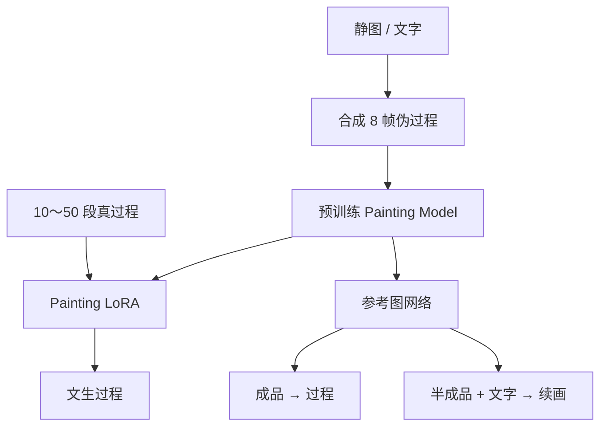

# ProcessPainter

先看 [[入门-读论文前先看]]。这篇用到：[[扩散模型]]、[[微调]]、[[LoRA]]、[[对错怎么量-损失]]。

全文译文：[[ProcessPainter-译文]]。要点：[[ProcessPainter-要点]]。原文：[[ProcessPainter.pdf]]。

## 原文 PDF

[[ProcessPainter.pdf]]

## 一句话

用时序扩散直接生成作画过程：先在合成序列上预训练，再用很少的真人过程做 LoRA。

## 要解决什么问题

Learning to Paint、Paint Transformer 也能吐出一串笔画，但目标是减小当前画布和原图的像素差。步骤不像人：不会先铺大色块再收细节。

作者改问：过程本身就是生成目标。输入可以是文字或参考图，输出是从大关系到细节的一串关键帧。并做成三件事：文生过程、成品反推过程、半成品续画。

## 原理

主干不是强化学习，是带时间模块的潜扩散（思路接近 AnimateDiff）。

数据分两层：

1. 用 Learn-to-Paint、Paint Transformer、Stylized Neural Painting，以及「按深度从近到远往画布上贴物体」，把静图做成伪过程，用来预训练。
2. 请画家提供真过程，用 LoRA 微调空间注意力和时间注意力，让步骤更像人。

参考图网络（Artwork Replication Network）类似 ControlNet。参考图卡在最后一帧 = 反推过程；卡在第一帧 = 半成品续画。

换 LoRA 就能换画法：厚涂油画、半透明贝塞尔、水墨薄涂。

## 算法解析

### 输入 / 输出

- 文生过程：提示词 → 8 帧 512×512
- 图生过程：成品参考图控制最后一帧 → 过程序列
- 续画：半成品控制第一帧 + 文字 → 后续帧

### 训练时怎么走

1. 在 3 万段合成序列上预训练 UNet 的空间和时间注意力。
2. 冻住 Painting Model，训参考图网络。
3. LoRA 分两步：先只用最后一帧训空间注意力 LoRA，避免「没画完的图」把画质带崩；再冻住它，用整段序列训时间注意力 LoRA。
4. 优化器 Prodigy。学习率 $2\times10^{-5}$，batch 1，A100。推理 DDIM 50 步，并用 DDIM inversion 做噪声替换，让指定帧贴住参考图。

### 推理时怎么走

- 纯文生：不用参考图网络。
- 反推 / 续画：参考图网络接管指定帧。$\tau$ 越靠近开头，画得越满。

### 关键量

合成序列固定 8 帧。采样时首尾帧各 1/3 概率，中间帧按中间高的正态分布。作者说这样更像真实使用。

## 重要段落精翻

### 1. 和笔画渲染的差别（第 4.4.1 节）

> baseline methods … are fundamentally designed to minimize the difference between the real image and the current canvas, resulting in a painting process that does not conform to human painting habits.

**精翻：** 基线本质上是在缩小原图和当前画布的差，所以过程不符合人的作画习惯。

**为什么重要：** 这是油画第 3 档相对第 1 档的分界。只报最后一帧像不像，不够。

### 2. 少量真过程（Fig. 4 图说）

> A Painting LoRA can be fine-tuned only on 10-50 sequences of artists’ painting process, which can effectively capture the characteristics of the artists’ painting process and the style of the final results.

**精翻：** 只用 10 到 50 段画家过程微调 Painting LoRA，就能抓住这位画家的步骤习惯和最终风格。

**为什么重要：** 素描真过程也少。可以先伪过程预训练，再收一点真人延时。

### 3. 数据规模（第 3.3 节）

> Our dataset construction includes 30,000 synthetic painting sequences for pretraining, each with 8 frames at a resolution of 512x512, and 95 painting sequences from artists for LoRA training.

**精翻：** 预训练用 3 万段合成过程，每段 8 帧、512×512；LoRA 用 95 段画家过程。

**为什么重要：** 真过程只有 95 段，分三个画家（厚涂肖像、风景色块、线稿上色）。量不大，靠合成撑起来。

## 图在讲什么

| 图 | 在讲什么 |
|---|---|
| Fig. 3 | 文生过程的四种合成画法：半透明贝塞尔由抽象到具体；小笔触油画；笔触由大到小；按物体分区画。 |
| Fig. 4 | 10～50 段真过程 LoRA 之后的三种真人画法。 |
| Fig. 5 | 和 LearnToPaint、Paint Transformer、Intelli-Paint、Stylized Neural Painting 比：最后一帧更贴，中间更像人。 |
| Fig. 6 | (a) 成品反推过程；(b) 同一张半成品，换提示词走出不同续画。 |
| Fig. 7 | 消融：没有 DDIM 噪声替换、没有参考图网络，最后一帧都对不齐。 |

## 原图裁图

从 PDF 裁出的 5 张关键图。故事和数字见 [[ProcessPainter-译文]]。

首页任务图（PDF 第 1 页，图 1）。三行分别是文生过程、成品反推、半成品续画。红框标出卡住的那一帧。

![[图/ProcessPainter/fig1.png]]

总流程（PDF 第 4 页，图 2）。左：假过程预训练。中：真人过程上训两截 LoRA。右：推理时换噪声、卡住参考帧。

![[图/ProcessPainter/fig2.png]]

假过程预训练后的四种机器画法（PDF 第 6 页，图 3）。由糊到清楚、小笔触聚形、大色块收细、按物体分区。

![[图/ProcessPainter/fig3.png]]

10 到 50 段真过程微调之后（PDF 第 6 页，图 4）。上排是画家样本，下排是生成。左风景色块，中线稿上色，右厚涂肖像。

![[图/ProcessPainter/fig4.png]]

参考图网络的两个用法（PDF 第 7 页，图 6）。(a) 成品卡在最后一帧。(b) 同一张半成品，换提示词走出雪景或火山。

![[图/ProcessPainter/fig6.png]]

## 数据与实验

| 项 | 数字 |
|---|---|
| 合成 | 从 DiffusionDB 按美感抽 1 万张静图，三种 SBR + 深度分层，做成 3 万段 |
| 真过程 | 3 位画家，共 95 段 |
| 硬件 | NVIDIA A100 |
| 推理 | DDIM 50 步 |

**最后一帧重建（Table 1，图生过程）**

| 方法 | MSE↓ | LPIPS↓ | L1↓ |
|---|---|---|---|
| LearnToPaint | 0.016181 | 0.033240 | 0.087082 |
| Paint Transformer | 0.087695 | 0.153372 | 0.187685 |
| Intelli-Paint | 0.247486 | 0.397536 | 0.350746 |
| Stylized Neural Painting | 0.084447 | 0.141126 | 0.185832 |
| 本文 | **0.014820** | **0.024517** | **0.082165** |

注意：这张表只证明最后一帧更贴。过程像不像人，靠用户研究。

**用户研究（Table 2）**

| 对比 | 更像人 (%) | 更喜欢 (%) |
|---|---|---|
| vs LearnToPaint | 78.2 | 68.2 |
| vs Paint Transformer | 80.4 | 65.9 |
| vs Intelli-Paint | 84.5 | 78.4 |
| vs Stylized Neural Painting | 78.6 | 71.6 |

## 这些数字对素描意味着什么

1. **最后一帧更贴（LPIPS 0.025 vs 0.15），不等于过程像人。**  
   Table 1 只量最后一张。真正支撑「像人」的是 Table 2：大约 78%～85% 的人觉得比笔画渲染更像人在画。素描实验必须两张表都报。只报最后一张像不像石膏像，会被说成普通生成。

2. **3 万段假过程 + 95 段真过程。**  
   真过程极少也能微调出画法。素描可以：先用「成品反推四段」造假过程，再收十几段课堂延时。不要等 300 段石膏像录像才开工。

3. **10～50 段就能换一种画法。**  
   厚涂、线稿上色、色块风景，靠换一小截边路。素描可以换「排线疏 / 排线密」两套边路，当作媒介特化，对应油画第 2 档的故事。

4. **文生、反推、续画装在一篇里。**  
   主论文故事可以同样装三个：文字出素描过程、成品反推过程、半成品按阶段往下画。不要拆成三篇灌水。

5. **8 帧、512 边长、假过程来自 Learn-to-Paint 一类。**  
   假过程本身不像人。预训练只是让网络知道「图会随时间变」。像人这件事，靠 95 段真过程纠正。素描的假过程若只用照片描边，后面必须有真人阶段来纠偏。

## 和本课题的关系

素描要冲 CCF-A 的主论文，最该对标这篇。差别要写死：油画过程是色块和笔触层；素描过程是构图、结构线、排线、收细。

[[StrokeFusion]] 生成无序笔画集合；这篇生成有时间顺序的过程。

## 可借鉴

- 伪过程预训练 + 真过程少量微调。
- 一篇里装三个任务：文生、反推、续画。
- 评价同时报最后一帧误差和「像不像人」。
- 和 [[Inverse-Painting]] 一起引用。

## 局限

- 关键帧过程，不是每一笔矢量轨迹。
- 真过程只有 95 段，风格覆盖有限。
- 直接搬到素描会丢「线的顺序和疏密」。
- Table 1 不衡量中间帧顺序。

## 还要回原文看的

Fig. 3～7 必须对着 PDF 看。正文很短（会议版约 9 页），附录不多。
