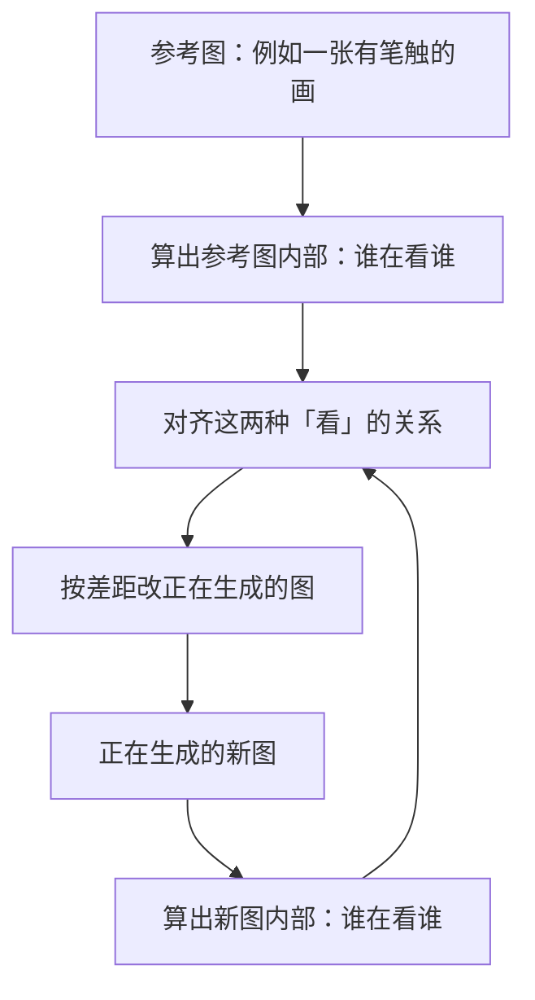
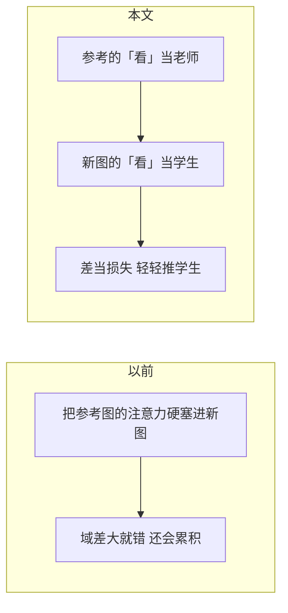

# Attention Distillation

先看 [[入门-读论文前先看]]。这篇用到：扩散、注意力、微调。

## 原文 PDF

[[Attention-Distillation.pdf]]

## 一句话

深大周漾组：不另训一个大画家，而是在现成扩散模型里对齐「该看哪」的关系，把参考图的风格、外观、纹理迁到新图上。

## 要解决什么问题

有人把扩散模型内部的注意力，直接灌到新图里。图和参考差得远时，会对不齐、还会越灌越错。

作者改算一种「注意力蒸馏」：先构想「理想风格化结果」心里在看哪，再和当前结果比，把差距当损失，推着生成图去像参考。

## 原理

注意力可以粗想成：每个位置问「我该参考图像里的谁」。风格往往藏在这些「谁和谁有关系」里，而不只藏在平均颜色里。

损失嵌在扩散一步步去噪的过程里，也能接到「按线控图」、文生图、纹理合成上。

## 算法示意图

## 重要段落精翻

### 1. 贡献（第 1 节）

> we propose a novel attention distillation loss for reproducing the visual characteristics of a reference.

**精翻：** 我们提出一种新的注意力蒸馏损失，用来复现参考图的视觉特征。

**为什么重要：** 深大在「成品风格」上已经有 CVPR。开题写「组里会做扩散艺术」可以引这篇。不要写成素描过程。

## 论文原图在讲什么

Fig. 1 一类图：同一内容，换不同参考，纹理和笔触跟着变，结构尽量保住。

## 数据与实验

主要在风格迁移、外观迁移、纹理上展示。和当时灌注意力的方法比，域差大时更稳。具体表以 PDF 为准；对素描课题，数字本身不是主尺子。

## 这些数字对素描意味着什么

1. **这篇管「像哪张范画」，不管「先画哪一步」。**  
   排线味道可以放在第 4 阶段（细节收束）借用：让最后的调子像某张范画。第 1、2 阶段不要用它，否则大形会被风格带着跑。

2. **深大故事要拆成两条线。**  
   [[StrokeFusion]] / [[PDF-Sketch]] 是「画出矢量草图」。这篇是「把风格迁过去」。不要在开题里揉成一句「深大已经做了素描扩散」。

3. **没有过程数据时，冻结大模型 + 推一把生成结果，也能出活。**  
   和 [[DiffSketcher]] 同类思路。适合做小实验，不适合当主论文唯一方法——每张都要推，扩不出过程数据集。

## 和本课题的关系

对照，不是基线。处理成品风格，不是阶段。

## 可借鉴

- 风格对齐放最后一阶段。
- 开题「深大已有扩散艺术生成」用这篇撑一句即可。

## 局限

- 不做笔画，不做过程。
- 和 StrokeFusion 不是一条线。

## 还要回原文看的

方法公式和对比图。素描课题不必精读实验表。
