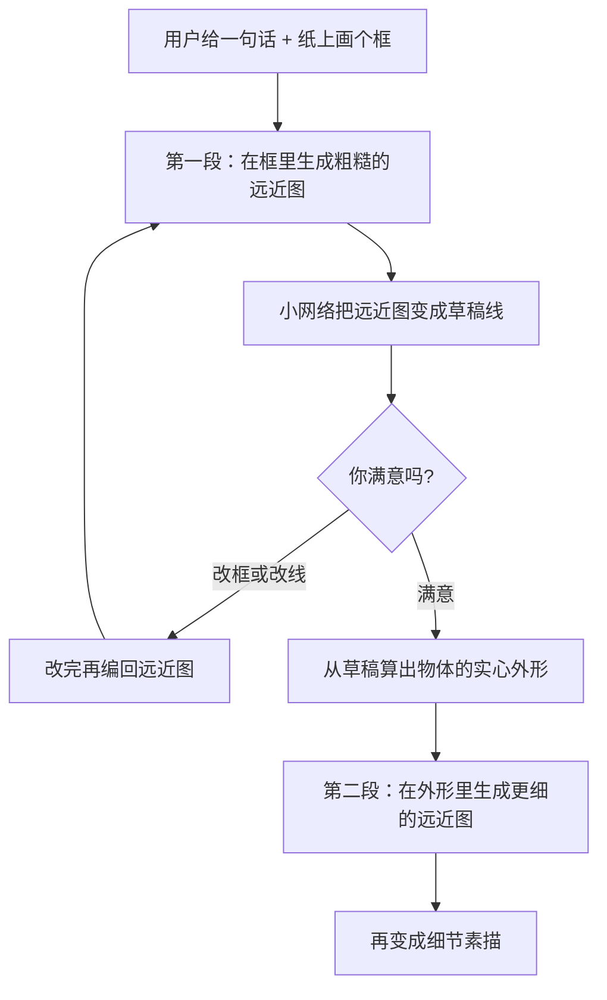
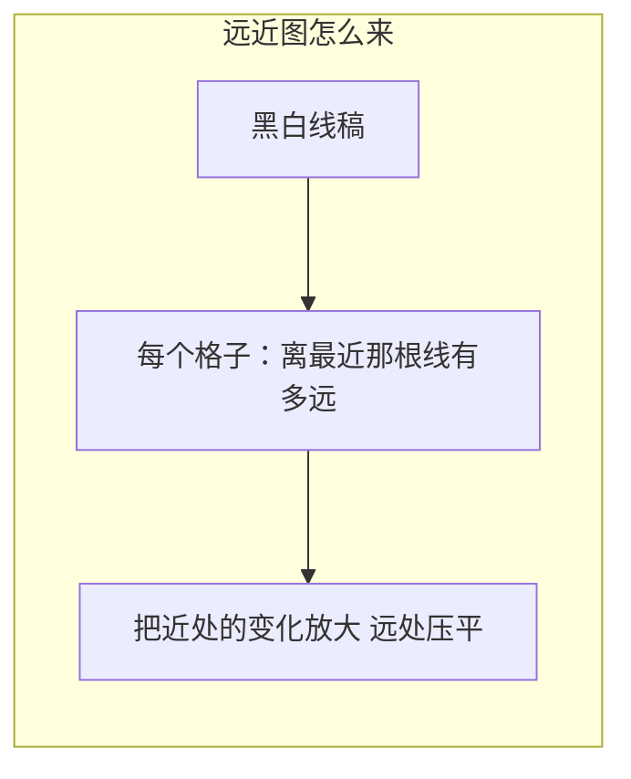

# CoProSketch

先看 [[入门-读论文前先看]]。这篇用到：扩散、栅格、损失、用户打分。

## 原文 PDF

[[CoProSketch.pdf]]

## 一句话

先在框里画出物体的大形，你觉得不对可以改；再在物体轮廓里加细节。一共两段，不是一次出终稿。

## 要解决什么问题

[[DiffSketcher]] 这类方法每张图都要优化很久，而且一次就出最终线。中途没法改「头再大一点」。

作者改成：前馈、可停下来改、分两段走。

## 原理

线很细，直接让扩散模型预测黑白像素，线容易断、也容易脏。他们改存一种「离线有多远」的图：线上是 0，离线越远数字越大。这种图更光滑，网络好学。学完再用一个小网络把这张「远近图」变回线。

两段共用同一个以 SDXL（一种更大的文生图扩散）改来的生成器。控制信号是框和外形，不是油画那种色块层。

## 算法示意图

训练时还要一个「远近图 → 线」的小网络，以及「远近图 → 实心外形」的网络（结构有点像自动抠图）。数据大约 10 万对：照片先变成线，再变成远近图。物体外形来自现成的显著物体数据。

## 算法解析

### 进什么、出什么

- 进：一句话 + 纸上的框（第一段）；框 + 物体外形（第二段）
- 出：草稿线，然后是细节线
- 中间量：远近图，不是直接的黑白像素

### 关键设计

把扩散模型最前面的通道加倍，把「外形图」和噪声叠在一起，强迫线画在框里。作者说：白边太多会让美感分数变亏，比分时会把别人的线也缩进同样的框，才公平。

## 重要段落精翻

### 1. 为什么用远近图（第 3 节附近）

> we adopt a 2D unsigned distance field (UDF) to represent a sketch.

**精翻：** 我们用二维的「离线有多远」来表示一张素描。

**为什么重要：** 线是细的，远近图是厚的。厚的图更好交给扩散模型。[[StrokeFusion]] 也用类似想法，但是用在每一笔上。

### 2. 中途能改（摘要级）

> If users find the results unsatisfactory, they have the option to edit the rough result.

**精翻：** 用户若觉得草稿不好，可以改完再往下走。

**为什么重要：** 这是「递进」对用户的意义。只有两段：粗、细。没有结构线和排线。

## 论文原图在讲什么

| 原图 | 看什么 |
|---|---|
| Fig. 3 | 线 → 远近图 → 变换后的远近图。 |
| Fig. 5 | 数据样例：上排草稿，下排细节。 |
| Fig. 6 | 和 DiffSketcher、先文生图再描线等方法比。别人常画出框，或背景杂线很多。 |

## 数据与实验

约 10 万样本。用 ChatGPT 出大约 100 句提示，随机框，做考卷。

**Table 1（美感 / 图文一致，越高越好）**

| 方法 | 美感 | 图文一致 |
|---|---|---|
| 大扩散 + 描边 | 3.73～4.13 | 0.19～0.23 |
| DiffSketcher | 4.043 | 0.217 |
| 本文 | **4.256** | **0.245** |

**Table 2 33 人投票（谁最好）**

| | 好看 | 像那句话 | 有没有画在框里 |
|---|---|---|---|
| 大扩散再描线 | 0.385 | 0.206 | 0.209 |
| 本文 | 0.376 | **0.642** | **0.721** |

好看这项，别人略高。控制和像不像那句话，本文高很多。

去掉远近图：美感 4.256→4.037，图文 0.245→0.219。

## 这些数字对素描意味着什么

1. **「画在框里」投票 0.72，别人只有 0.21。**  
   素描课堂第一件事就是构图占位。框和外形是便宜的控制。你的第 1 阶段（构图 / 大形）很适合先学他们：先保证画在该画的地方。

2. **好看没有赢，控制和语义赢了。**  
   说明：只报美感会被「先出一张漂亮彩图再描线」压过。过程、可控，才是你该打的仗。开题别把「线条比 DiffSketcher 更漂亮」当主贡献。

3. **只有粗、细两段。**  
   石膏像素描中间还有结构线和排线调子。两段会被审稿人说：和他们差一层 U 形网络而已。你必须把阶段对齐美术课，并准备过程数据。

4. **10 万对来自照片转线，不是人画的过程。**  
   线的味道像「照片描边」，不像课堂素描。真要冲过程，数据得换成：同一对象的大形稿、结构稿、调子稿，而不是 10 万张互不相关的物体线。

5. **前馈，不用每张优化半小时。**  
   这点对以后做交互很重要。[[DiffSketcher]] 做不到。主论文应坚持前馈或短时扩散，不要退回「一张图优化 300 步」。

## 和本课题的关系

写相关工作必引。它证明素描扩散可以递进。但只有粗 / 细，没有结构线和排线，也没有从成品反推全过程。

## 可借鉴

- 阶段之间用外形衔接，人能插一手。
- 中间用远近图，线更干净。
- 故事：他们证明递进可行；我们把递进换成美术阶段，并补过程。

## 局限

- 仍是预印本。
- 两段对全调子素描不够。
- 没有和时间序列过程（[[ProcessPainter]]）同级的建模。

## 还要回原文看的

Fig. 6 对比图。远近图变换公式在第 3 节，看一眼即可。
