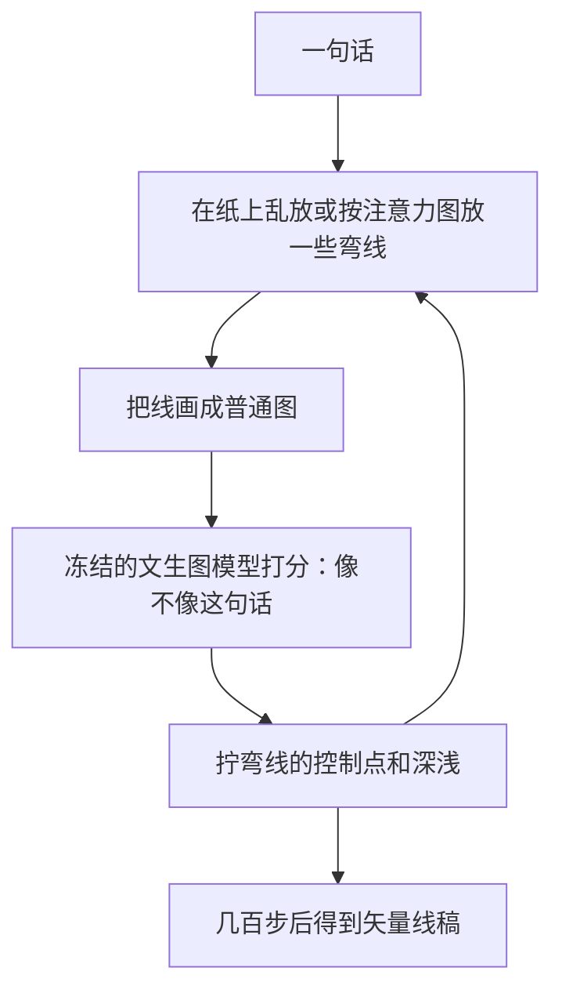
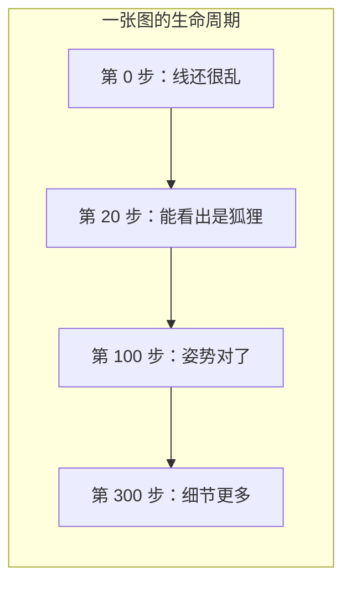

# DiffSketcher

先看 [[入门-读论文前先看]]。这篇用到：[[扩散模型]]、[[分数蒸馏]]、[[贝塞尔曲线]]、[[可微渲染器]]。

全文译文：[[DiffSketcher-译文]]。要点：[[DiffSketcher-要点]]。原文：[[DiffSketcher.pdf]]。

讲解是 NeurIPS 2023 Poster：https://neurips.cc/virtual/2023/poster/72425

## 一句话

不训练素描大数据。借用已经会文生图的扩散模型当老师，慢慢拧一组曲线的控制点，直到这组线「看起来像那句话」。

## 要解决什么问题

以前用「图和字对过齐的模型」拧曲线（CLIPasso 一类），场景复杂时容易只画出主体，背景和关系弱。作者问：已经会画照片的扩散模型，能不能当素描老师？

答案是能。但每张都要当场优化，常常要几百步。

## 原理

把素描定义成一组 [[贝塞尔曲线]]（两点之间的光滑弯线，中间有控制点）。[[可微渲染器]] 先把这些线画成一张普通图，再问冻结的文生图 [[扩散模型]]：「这张图和那句话，对得上吗？」对不上就拧控制点。损失是改过的 [[分数蒸馏]]，论文叫 ASDS。

另外从扩散模型内部的「现在该看哪」图里，找出主体大概在哪，把初始线放在那里，收敛更快。

注意：这里没有「训练一个素描生成器」。大模型参数不动。动的是这张图上的那些控制点。换一句话，就要重新拧。

## 算法示意图

论文 Fig. 1 下面一排数字 0、20、60……就是优化步数，不是画家的作画阶段。不要看成「先构图再排线」。

![[图/DiffSketcher/fig1.png]]

![[图/DiffSketcher/fig1-iters.png]]

## 算法解析

### 进什么、出什么

- 进：一句话
- 出：一组带控制点的矢量线
- 不需要成对的「这句话对应这张素描」大数据

### 机器怎样知道自己错了

三部分加在一起（人话）：

1. **ASDS（扩散老师）**：线稿加一点透视、裁切扰动，再问冻住的扩散模型像不像那句话。这是改过的 [[分数蒸馏]]。
2. **感知差（JVSP）**：线稿渲染图，和扩散模型自己想象的图，人眼看来差多少。
3. **图意差（JVSP）**：线稿和想象图，在「图和字对过齐」的空间里差多少。

还有一项管线的深浅，让有的线淡、有的线浓，更像手绘。

## 重要段落精翻

### 1. 发现（摘要）

> Even though trained mainly on images, we discover that pretrained diffusion models show impressive power in guiding sketch synthesis.

**精翻：** 这些扩散模型虽然主要在普通图片上训练，我们却发现它们指导素描合成的能力很强。

**为什么重要：** 没有素描大数据时，也能借照片模型盯语义。过程数据少时，同样可以借。但借来的是「像那个东西」，不是「像人那样一步步画」。

### 2. 优化曲线（摘要）

> It performs the task by directly optimizing a set of Bézier curves with an extended version of the score distillation sampling (SDS) loss

**精翻：** 它直接优化一组贝塞尔曲线，损失是改过的「分数蒸馏」（一种把扩散模型当成老师的损失）。

**为什么重要：** 优化的是这张图的线，不是一个以后能秒出图的网络。[[CoProSketch]] 后来批评它慢、不能中途改布局。

## 论文原图在讲什么

| 原图 | 看什么 |
|---|---|
| Fig. 1 | 上：不同句子的线稿。下：同一种线，优化步数增加。蓝数字是迭代次数。 |
| Fig. 5 | 交叉注意力 + 自注意力合成落笔热力图。 |
| Fig. 6 | 和 CLIPasso、描边比。场景稿别人容易只画主体。 |
| Fig. 7 | 和 VectorFusion 比。两边都拧矢量，这篇盯素描。 |
| Fig. 8 | 消融：初始化、JVSP/ASDS、随机 init；列数字是 iters。 |

![[图/DiffSketcher/fig6.png]]

![[图/DiffSketcher/fig7.png]]

## 数据与实验

没有自建素描过程库。评价跟当时习惯：美感、和图文是否一致，再加展示。作者强调场景级也能画，不限于单个物体。

一张图常见要优化到一两百步以上。论文图里画到 300。

## 这些数字对素描意味着什么

1. **「像那句话」靠的是照片扩散老师，不是素描老师。**  
   石膏像、光影排线，照片模型并不懂。你若只抄这个损失，模型会画出「能认出是人」的简笔，画不出课堂调子。

2. **Fig. 1 的 0→300 不是美术阶段。**  
   写相关工作时务必写清：这是优化过程，不是作画过程。审稿人若混为一谈，对你不利，也对你有利——你要主动划清。

3. **每张都优化，做不了过程数据集。**  
   要生成「同一石膏像的 20 个中间稿」，用它会炸时间。过程模型必须前馈，或至少一次出一串帧。

4. **矢量是真优点。**  
   线还能改。油画过程论文多为 JPG。素描主论文应保住矢量或「线的远近图」，不要退回纯色块视频。

5. **注意力图适合当第 1 阶段的落笔位置。**  
   大形阶段可以借：先看主体在哪，再下几根长线。不要整张纸乱撒。

## 和本课题的关系

它证明扩散先验能管「像不像那个东西」，但不管「先画什么」。只做文生矢量线，会和这篇挤道。要拉开，必须加阶段和过程。

## 可借鉴

- 没有大数据时，用冻结大模型盯语义。
- 注意力图给构图初始化。
- 评价可看「同样一句话，线少和线多」的抽象程度。

## 局限

- 一张图几分钟，不能交互。
- 输出是终稿，不是过程。
- 风格偏能认出物体的简笔。

## 还要回原文看的

损失公式很长，看笔记里的三句话即可。裁图已在上面。细节和精翻见 [[DiffSketcher-译文]]。
