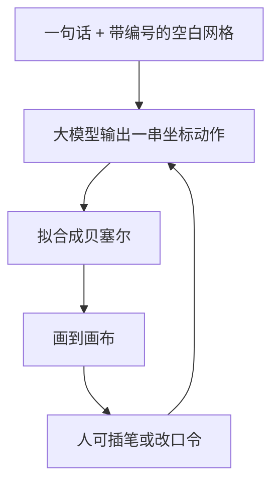

# SketchAgent

先看 [[入门-读论文前先看]]、[[任务定义]]。这篇用到：[[自回归]]、[[贝塞尔曲线]]、[[矢量图]]、[[CLIP]]。

全文译文：[[SketchAgent-译文]]。要点：[[SketchAgent-要点]]。原文：[[SketchAgent.pdf]]。

讲解：CVPR 2025 是 **Poster**，不是 Oral。作者研讨（含 SketchAgent 过程）：https://www.youtube.com/watch?v=QaxkssbuHhw  
项目页：https://yael-vinker.github.io/sketch-agent/

首页图（PDF 第 1 页）：左列文字出简笔，中列人和模型轮流加笔，右列对话改内容。

![[图/SketchAgent/p01-01.png]]

## 一句话

不另训网络。让现成多模态大模型用网格坐标一笔一笔「说话」，再拟合成线。

## 要解决什么问题

优化一组曲线（[[DiffSketcher]]、[[分数蒸馏]]）时，所有笔画一起动，中间步没有笔序。大模型直接写 SVG 又太工整，不像手绘。

## 原理

## 局限（原文第 7 节）

复杂物体和人物常抽象到认不出。字母数字也弱。像儿童简笔，不是课堂调子。

## 和本课题的关系

证明「逐步画」能发 CVPR。质量不够当素描课。我们要比的是阶段和调子，不是再做一个不训练的聊天画手。

## 可借鉴

对话中途改、网格降低空间难度。

## 原图裁图

Fig. 1 见上。下面三张是后裁的。

局限图在正文是 Fig. 14（第 7 节）。附录 Fig. 15 是网格语言的单笔图元，不是失败样。

![[图/SketchAgent/fig03.png]]

Fig. 3：同一只眼。扩散一次出像素，直接写 SVG 太圆太齐，本文更像乱笔。

![[图/SketchAgent/fig14.png]]

Fig. 14：复杂物、人、字母数字都垮。作者自己给的失败样。

![[图/SketchAgent/fig15.png]]

Fig. 15：系统提示里的单笔，用来教 `x8y6` 这种说法。

## 还要回原文看的

Fig. 1、Fig. 3、Fig. 14（第 7 节局限）。附录 Fig. 15 是图元。精翻见译文页。
