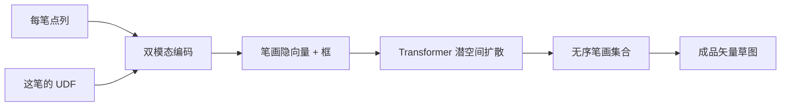

# StrokeFusion

先看 [[入门-读论文前先看]]。这篇用到：[[扩散模型]]、[[潜空间]]、[[距离场]]、[[Transformer]]、[[FID]]。

全文译文：[[StrokeFusion-译文]]。要点：[[StrokeFusion-要点]]。原文：[[StrokeFusion.pdf]]。

## 原文 PDF

[[StrokeFusion.pdf]]

## 一句话

把每笔编成隐向量，用潜空间扩散一次生成整张矢量草图。笔画当无序集合，长度可变。

## 要解决什么问题

栅格草图容易出不是笔画的脏点。矢量草图按折线顺序预测，误差会累积，整体也不够像。同一类局部（眼睛、轮子）出现在图的不同位置时，旧方法难抽出共用特征。

作者分两段，但这两段是「编码 / 生成」，不是「起稿 / 排线」。

## 原理

1. **双模态编码**：每笔先放到自己的包围盒里归一化，既看点列，也看这笔的无符号距离场，融成一个隐向量。布局（框）和形状（轨迹）分开。
2. **笔画级扩散**：同时去噪位置、尺度、轨迹和「这笔在不在」。生成时当集合，不靠自回归一笔接一笔。

编码冻住之后再训扩散，两边表示一致。

## 算法解析

### 输入 / 输出

类别条件 → 一组矢量笔画。不是过程视频。

### 训练时怎么走

第一阶段训编码器（矢量 + UDF）。第二阶段冻住编码器，用 16 层 Transformer 在隐空间去噪。评价前用 Ramer–Douglas–Peucker 简化笔画，减少采样分辨率干扰。指标在 1 万张采样图上算。

### 关键量

去掉笔画归一化：FID 明显变差（月亮 25.00→46.73，电视 16.28→105.65）。去掉图像级监督：蜘蛛 Recall 从 0.48 掉到 0.001。UDF 分支关掉大约损失一截结构能力（附录称大约 10% 量级，以原文为准）。

## 重要段落精翻

### 1. 越复杂越占优（第 4 节）

> The results show that our method becomes increasingly advantageous as the stroke count grows.

**精翻：** 笔画越多，我们的方法优势越明显。

**为什么重要：** 简单苹果、月亮上，ChiroDiff 有时 FID 更好。人脸、多笔画类别才拉开。石膏像素描笔画更多，这套编码有用，但他们用来出成品，不是出过程。

### 2. 人脸为什么涨得多

> Facial sketches require precise spatial alignment of features like eyes and mouth, which are often distorted by sequential methods due to error accumulation. Our model avoids this by directly predicting stroke positions.

**精翻：** 人脸草图要求眼睛、嘴对齐。顺序方法会因误差累积把五官画歪。我们直接预测笔画位置，避开这件事。

**为什么重要：** 无序集合能稳住结构，也故意丢掉笔序。本课题要的是笔序，不能照搬「无序」这个设定。

## 图在讲什么

| 图 | 在讲什么 |
|---|---|
| Fig. 1 | 方法总图。上半编码，下半无序扩散。见裁图。 |
| Fig. 2 | 从左到右是噪声变少，不是先大形后五官。 |
| Fig. 3 | QuickDraw 上和 SketchRNN 等并排，本文结构更稳、变化更多。 |
| Fig. 4 | Creative Birds / Creatures、FaceX、TU Berlin。 |
| Fig. 6 / Table 3 | 去掉归一化或图像监督后的崩法。 |

## 裁图

方法总图（PDF 第 3 页，Fig. 1）。每笔走点列和[[距离场]]。无位置编码的[[Transformer]]在[[潜空间]]里一次去噪整组笔画。

![[图/StrokeFusion/fig1-method.png]]

Table 1 所在页上的分组表（PDF 第 6 页）。QuickDraw 按平均笔数分组的成品[[FID]]。少于 4 笔时 ChiroDiff 更好。笔越多本文越赢。这是成品分布，不是过程分。

![[图/StrokeFusion/table1.png]]

QuickDraw 对比（Fig. 3）。虚线下半更复杂。仍是终稿并排。

![[图/StrokeFusion/fig3-quickdraw.png]]

更难数据对比（Fig. 4）。FaceX 上五官对齐最明显。同样是成品。

![[图/StrokeFusion/fig4-harder.png]]

## 数据与实验

- QuickDraw：超 5000 万、345 类，实验用 14 类。
- TU Berlin：2 万张、250 类，非画家画的。
- 另有 Creative Birds、Creative Creatures、FaceX。

**Table 1 QuickDraw（按平均笔画数分组）**

| 方法 | <4 笔 FID | <8 笔 FID | ≥8 笔 FID |
|---|---|---|---|
| SketchRNN | 31.61 | 36.98 | 40.67 |
| SketchKnitter | 23.17 | 27.07 | 35.64 |
| ChiroDiff | **17.17** | 23.84 | 27.78 |
| StrokeFusion | 19.53 | **18.99** | **17.76** |

**Table 2 更难的数据**

| 方法 | Creative Birds | Creative Creatures | FaceX | TU Berlin |
|---|---|---|---|---|
| SketchRNN FID | 59.85 | 121.02 | 155.02 | 98.01 |
| ChiroDiff FID | 60.10 | 36.66 | 99.33 | 98.30 |
| StrokeFusion FID | **26.19** | **19.41** | **7.27** | **33.68** |

FaceX 上从约 99～155 降到 7.27，是最大的数字。

## 这些数字对素描意味着什么

1. **笔画越多，本文越赢；少于 4 笔时，别人 FID 更好。**  
   石膏像素描笔画远多于 4。笔画级隐空间值得当骨干。但他们用来一次倒出成品。你若用同一骨干，必须加上「现在是第几阶段」这个条件，否则又变成成品生成，和这篇撞车。

2. **人脸数据上，FID 从大约 100 掉到 7。**  
   五官对齐靠「直接预测位置」，不靠一笔接一笔。结构阶段可以借：先落眼睛、鼻子的框，再填线。大形阶段不要用无序集合，否则会丢掉「先外轮廓后五官」的课。

3. **去掉「每笔先放到自己的框里」，电视类 FID 从 16 爆到 105。**  
   归一化非常重要。排线阶段：每组排线先放到局部框里学「平行短线」，再放到脸上。不要让同一网络同时学「眼睛的形」和「眼睛在左上角」。

4. **指标全是成品分布。**  
   Precision / Recall / FID 都不看顺序。你的论文若只报这三项，审稿人会说：和 StrokeFusion 同一张表。必须加阶段对不对、一次改一块、人看像不像课堂示范。

## 和本课题的关系

必须引用，也必须划清界限。深大已经把矢量素描生成发到 CCF-A。它生成成品草图的笔画集合，没有人类素描阶段，也没有「先大形后调子」。

本课题如果只重复「更好的矢量扩散」，会和这篇撞车。应该补它缺的过程。

对应作者：徐鹏飞、黄惠，深圳大学计算机与软件学院。

## 可借鉴

- 笔画级隐空间比直接预测折线稳，可以当骨干。
- 双模态（矢量 + 距离场）同时保住几何和外观。
- 相关工作写法：StrokeFusion 解决「画得出」，我们解决「画得按步骤」。

## 局限

- QuickDraw 是简笔，不是美术素描。
- 无序生成故意丢掉笔序。
- 没有阶段标签，也不能从半成品按阶段往下画。

## 还要回原文看的

精翻见 [[StrokeFusion-译文]]。Table 1、Fig. 1 / 3 / 4 已裁进「裁图」。Fig. 2 的去噪条、Table 3 消融仍建议对着 PDF 看一眼。
