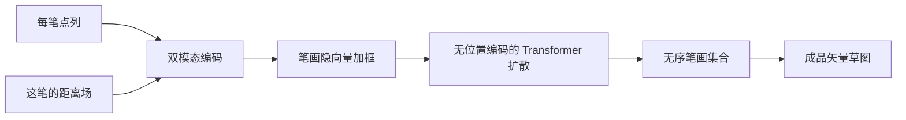

# StrokeFusion · 故事与方法译文

> [!warning] 旧意译，只留底
> 请改读 [[StrokeFusion-译文]]。不要再改本页。

对应笔记：[[StrokeFusion]]。原文：[[StrokeFusion.pdf]]。项目页：https://vcc.tech/research/2026/StrokeFusion

> [!abstract] 版权与写法
> 这里是**意译**，不是逐句复述全文。故事按作者口吻用中文重讲。方法按节写清。只对关键句做对照精翻。图用库内裁图，不整页贴 PDF。

## 作者想讲的故事

栅格草图好训，但容易出不是笔画的脏点。矢量草图保住轨迹，却常按折线顺序往下推。相对坐标好学「眼睛、轮子」这类局部，位置会漂，闭合也难。绝对坐标稳住位置，又难抽出共用的局部形。同一类局部还会出现在图的不同地方。

作者做成两段，但这两段是「先编码、再生成」，不是「先起稿、再排线」。第一段：每笔拆开，点列和这笔的无符号[[距离场]]一起压进[[潜空间]]。第二段：用笔画级[[扩散模型]]，一次去噪整组笔画的位置、尺度和轨迹。生成时当无序集合，长度可变。

代码与模型：摘要写发表后公开。项目页在深圳大学 VCC。对应作者徐鹏飞。

## 为什么故意无序

这是设计，不是漏了笔序。

顺序模型把整张图当成一条长折线。误差会往后传。人脸的眼睛、嘴最容易画歪。作者改成：每笔一个向量，外加包围盒和「这笔在不在」。[[Transformer]] 去噪时**不加位置编码**，谁先谁后都不算信息。长度用可见标志卡：$\hat{v}_i>0$ 才留下。超过数据集第 99 百分位的笔画数，训练时丢掉。附录写：超过 32 笔的样本丢掉，不够的用空笔补齐。

无序还为了两件事。笔画数因人而异，顺序也不固定。局部形（眼睛、轮子）先在自己的框里归一化，再单独预测框。形和布局拆开，就不靠「上一笔接到下一笔」。

Fig. 2 从左到右是噪声变少，不是先画大形再画五官。汉堡和脸是整组笔画一起变清楚。看上去像过程，其实是去噪。本课题要的课堂顺序，这篇正好丢掉了。

## 方法按节

### 总体在干什么

类别条件 → 一组矢量笔画。不是过程视频，也不能从半成品按阶段往下画。

### 数据怎么来

- QuickDraw：超过 5000 万、345 类。实验用 14 类。按平均笔数分成三组。少于 4 笔：apple、moon、shoe、umbrella、fish。少于 8 笔：chair、airplane、television、face、bus。不少于 8 笔：pizza、spider、cat、train。
- TU Berlin：2 万张、250 类，非画家画的。
- FaceX：只用正面。看五官对齐。
- Creative Birds / Creative Creatures：各约 1 万张。风格更跳。

每笔重采样成 $N_p=64$ 个点。整图先缩到 $[-1,1]$。每笔再在自己的包围盒里缩到 $[0,1]$。距离场还额外乘 $0.8$，免得贴边被切掉。锐度 $\gamma=50$。

### 模型怎么走

编码：点列走 6 层[[Transformer]]。距离场走 6 段卷积。两条拼起来，压成一个隐向量。解码对称。用的时候只走矢量解码，真正出可画的点。

扩散：每笔是 $[z_i, b_i, v_i]$。$b_i$ 是框，$v_i$ 是在不在。16 层[[Transformer]]，16 个头，宽 512，没有位置编码。先训编码器，再冻住，再训扩散。两边表示才对得上。

### 怎么知道自己错了

编码看三件事。点列的坐标差。距离场的像素差，再加一层观感损失。隐向量还要靠近标准正态。扩散按 DDPM，1000 步，预测噪声。评测前用 Ramer–Douglas–Peucker 简化笔画。指标在 1 万张采样图上算。尺子是[[FID]]、Precision、Recall。这三项都看成品分布，不看笔序。

## 图在讲什么

方法总图。上半：每笔走点列和[[距离场]]。下半：无位置编码的[[Transformer]]在[[潜空间]]里一次去噪整组笔画。

![[图/StrokeFusion/fig1-method.png]]

从左到右是噪声变少。只画出 $\hat{v}_i>0$ 的笔。这是去噪，不是先外轮廓后五官。

![[图/StrokeFusion/fig2-denoise.png]]

QuickDraw 对比。虚线下半笔更多。本文结构更稳。仍是终稿并排，没有阶段。

![[图/StrokeFusion/fig3-quickdraw.png]]

更难的数据。FaceX 上五官对齐最明显。同样是成品。

![[图/StrokeFusion/fig4-harder.png]]

Table 1 所在页上的分组表。少于 4 笔时 ChiroDiff 的[[FID]] 更好。笔越多，本文越赢。这是成品表，不是过程表。

![[图/StrokeFusion/table1.png]]

## QuickDraw 分组 FID

数字对着 PDF 第 6 页 Table 1。类按**平均笔画数**分组，不是按单张。

| 方法 | <4 笔 FID | <8 笔 FID | ≥8 笔 FID |
|---|---|---|---|
| SketchRNN | 31.61 | 36.98 | 40.67 |
| SketchKnitter | 23.17 | 27.07 | 35.64 |
| ChiroDiff | 17.17 | 23.84 | 27.78 |
| StrokeFusion | 19.53 | 18.99 | 17.76 |

Precision / Recall 也是本文最高。少于 4 笔：0.71 / 0.58。少于 8 笔：0.69 / 0.61。不少于 8 笔：0.71 / 0.58。

作者自己写：笔画越多，优势越明显。简单类上，拆开「落框」和「造形」没太多空间，有时略输给 ChiroDiff。笔一多、一笔更像一个部件，结构才拉开。

不要把这张成品表当主贡献来刷。它只说明终稿更像训练集。石膏像素描笔远多于 4，笔画级隐空间可以当骨干。但他们用来一次倒出成品。你若用同一骨干，必须加上「现在是第几阶段」。否则又变成成品生成，和这篇撞车。

更难数据的 Table 2 也是成品[[FID]]。FaceX 从约 99～155 降到 7.27，是五官对齐，不是课堂顺序。Creative Birds 上本文 26.19，Doodleformer 27.32，差距很小。Doodleformer 还不出可控矢量轨迹。

## 对素描过程意味着什么

1. **两段是编码 / 生成，不是起稿 / 排线。** Fig. 2 不能当过程证据。
2. **无序是故意的。** 结构稳住了，笔序丢掉了。大形阶段不要用无序集合，否则「先外轮廓后五官」会没了。
3. **Table 1 随笔数变好，只说明终稿。** 审稿人若只看到这张表，会说：和 StrokeFusion 同一张考卷。必须另报阶段对不对、一次改一块、人看像不像示范。
4. **每笔先放进自己的框，很有用。** 去掉归一化后，月亮 FID 从 25.00 到 46.73，电视从 16.28 到 105.65。排线阶段可以借：先在局部框里学「平行短线」，再放到脸上。
5. **QuickDraw 是简笔。** 不是美术素描。也没有半成品续画。

## 关键句对照

> A latent diffusion model that supports unordered, variable-length stroke generation, overcoming the limitations of sequential models.

**精翻：** 潜空间扩散支持无序、变长的笔画生成，用来克服顺序模型的限制。

**为什么重要：** 贡献第三条就是「不要顺序」。本课题不能照搬。

> The results show that our method becomes increasingly advantageous as the stroke count grows.

**精翻：** 笔画越多，我们的方法优势越明显。

**为什么重要：** 这是 Table 1 的读法。简单苹果、月亮上，别人 FID 可以更好。人脸、多笔画才拉开。仍是成品分。

> Facial sketches require precise spatial alignment of features like eyes and mouth, which are often distorted by sequential methods due to error accumulation. Our model avoids this by directly predicting stroke positions.

**精翻：** 人脸草图要求眼睛、嘴对齐。顺序方法会因误差累积把五官画歪。我们直接预测笔画位置，避开这件事。

**为什么重要：** 无序集合能稳住结构。代价是丢掉「先画哪」。结构阶段可以借「先落框」。大形阶段不要借「无序」。

> This is achieved by processing strokes as an unordered set without relying on positional encodings, thereby preserving permutation invariance throughout the generation process.

**精翻：** 笔画当无序集合处理，也不加位置编码，生成全程保持谁先谁后都一样。

**为什么重要：** Fig. 2 的「generation process」是去噪过程。不是人的作画过程。

## 这篇实现了什么

- 输入 → 输出：类别（或 FaceX 情绪）→ 一组可编辑的矢量笔画。不是阶段序列。
- 新模块：点列 + [[距离场]] 的双模态编码；布局和形状拆开；无位置编码的笔画级[[扩散模型]]。
- 公开数字（只写原文有的）：QuickDraw 三组 FID 为 19.53 / 18.99 / 17.76；少于 4 笔时 ChiroDiff 为 17.17。FaceX 的 FID 为 7.27。评测 1 万张，先做折线简化。
- 缺什么：笔序、阶段标签、半成品续画、美术素描数据。故意无序，所以不能当过程生成的主基线去刷成品表。
