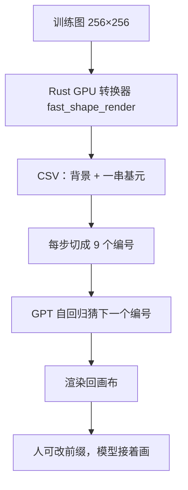
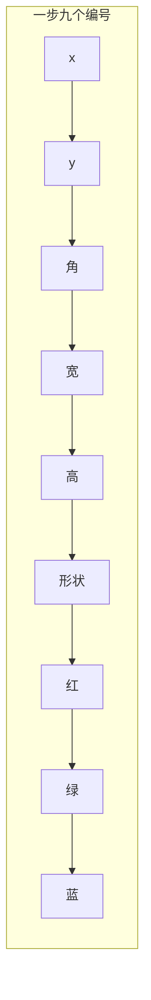

# Primitive Operation Painter

先看 [[入门-读论文前先看]]、[[任务定义]]。这篇用到：[[自回归]]、[[基元操作]]、[[离散词表]]、[[Transformer]]、[[指数滑动平均]]。

它**不是** CVPR / ICCV 论文。没有摘要、没有口头报告、没有公开实验表。它把「过程」写成了人能改的操作序列，正好补上顶会论文很少写的「前缀可改」。

## 代码和权重

- 代码：https://github.com/wonderfulearth/primitive-operation-painter
- 权重：https://huggingface.co/doubixz/primitive-operation-painter-weight
- 本地克隆：`复现/primitive-operation-painter`

公开权重是 `GeometrizeGPT` 的 EMA：词表 $2961$，[[Transformer]] $24$ 层，宽 $1024$，$16$ 个头。上下文 $144$ 步（前 $10$ 步给定，后 $134$ 步预测）。一步 $9$ 个离散编号。训练到第 $3$ 个 epoch、优化器步 $5397$，记录损失约 $3.81$。数据不随权重发布。

## 一句话

不直接吐像素。每一步往画布上放一个椭圆或旋转矩形，参数写成编号，用 GPT 猜下一步。

## 要解决什么问题

现成文生图只给人「一句话 → 最后一张」。中间怎么画的，人看不懂，也插不进手。

作者改问：能不能用**人读得懂、改得了**的操作来画？画完既是一张图，也是一份作画历史。

## 原理

1. **分解**：`fast_shape_render` 用 GPU 把图近似成背景 + 椭圆 + 旋转矩形，写出 CSV。默认一张图最多大约 $276$ 步（$1$ 背景 + $275$ 绘制）。
2. **编码**：一步 $9$ 个编号：中心 $x,y$、角度、宽、高、形状、红、绿、蓝。词表版本 `geometrize_256_v1`。坐标按像素切档，角度按度切档。
3. **预测**：因果[[注意力]]的 GPT，从左往右猜编号。推理可缓存历史键值。
4. **接着画**：示例给 $11$ 个真操作（$1$ 背景 + $10$ 基元），模型补到 $144$ 步。人改前缀里某一笔，历史变了，后面就会跟着变。

作者自己写了：这不是文生图，也不是像素编辑器。简单基元能铺大色块、能看过程，代替不了细纹理。也还没有做完的图形编辑器。改一笔不保证语义一定按你想的走。

## 算法示意图

训练时看整段 $144$ 步，但损失只算后 $134$ 步。位置嵌入表按 $256$ 步留着，多出来的后 $112$ 步冻住，为了能加载这份 $144$ 步权重。

## 和顶会论文差在哪

| 工作 | 每一步是什么 | 像不像人画素描 |
| :--- | :--- | :--- |
| [[Learning-to-Paint]] | 可微笔刷，强化学习 | 为减小像素差，不像课堂 |
| [[Inverse-Painting]] | 改一块栅格，有文字指令 | 像油画分层，不是线 |
| [[SketchAgent]] | 网格点拟合成贝塞尔 | 有顺序，像儿童简笔 |
| [[StrokeFusion]] | 无序笔画隐向量 | 成品稳，丢掉笔序 |
| 本项目 | 椭圆 / 矩形色块 | 过程可读可改，不是铅笔线 |

可借鉴：过程 = 可编辑前缀 + 接着预测。这正好补 [[Inverse-Painting]]「一步错后面一直错、中间稿不能当矢量改」的短处。

不可照搬：形状是色块，不是线、结构和排线。没有阶段标签。没有文生条件。没有和 QuickDraw / Sketchy 比过的公开数字，谈不上现成 SOTA。

## 可借鉴

- 把过程写成离散操作，人能改第 $k$ 步。
- 图 → 序列用 GPU 转换器造伪过程，对应 [[ProcessPainter]] 的合成预训练。
- 推理用 [[指数滑动平均]] 权重。

## 局限

- 不是顶会论文，审稿人不会把它当 SOTA 基线，除非你们自己复现出表。
- 椭圆矩形铺不出排线调子。
- 固定 $144$ 步、一步 $9$ 个编号，石膏像素描的长线序列装不下。
- 示例从 $11$ 步真值续画，不是从白纸文生。
- 训练数据不公开，损失 $3.81$ 不能当视觉质量。

## 怎么复现

见 [[40-复现Primitive-Operation-Painter]]。
