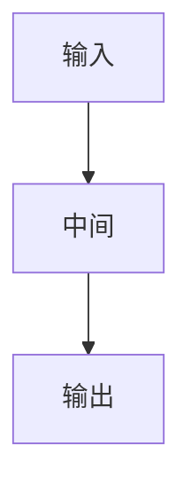

---
title:
short:
authors:
year:
venue: 开源项目
ccf:
arxiv:
pdf:
code:
weights:
tags:
  - 项目
status: 精读
---

# {{title}}

先看 [[入门-读论文前先看]]。这不是顶会论文，是可复现的开源实现。

## 代码和权重

## 一句话

## 要解决什么问题

## 原理

### 整体流程

## 和顶会论文差在哪

## 可借鉴

## 局限

## 怎么复现
