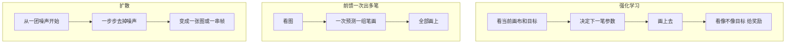

---
tags:
  - 研究
  - 入门
---

# 读论文前先看

后面每篇笔记都默认你看过这一页。英文专名第一次出现会跟中文。公式能不写就不写，要写也先用人话讲。

## 机器学习、深度学习差在哪

**机器学习**是一大类方法：给机器看很多例子，让它自己找出规律，用来猜新例子。传统做法常常要人先规定「看哪些特征」，比如线有多长、角有多尖。

**深度学习**是机器学习里的一种。它用很多层「神经网络」自己找特征。图、视频、句子现在基本都用这一路。

本课题读的论文，几乎全是深度学习。你可以先把它理解成：一个很大的函数，输入一张图或一句话，输出另一张图或一串笔画。这个函数里有几百万到几十亿个可调数字，叫**参数**。

## 训练、推理、测试

| 词 | 人话 |
|---|---|
| 训练 | 拿已有例子反复改参数，让输出越来越对 |
| 推理 / 测试 | 参数不再改，拿新图试试它会不会 |
| 监督 | 每个例子都有「标准答案」，比如下一帧长什么样 |
| 无监督 / 自监督 | 没有人标答案，机器用规则自己造答案 |

一篇论文里常有三个网络一起干活。**训练**时分开教；**推理**时串起来用。

## 损失：机器怎么知道自己错了

训练时，机器先乱猜，再拿猜的结果和标准答案比。这个差距叫**损失**（loss）。损失越大，改参数改得越狠。

不同损失盯的东西不一样：

- **像素差**：两个图对应位置颜色差多少。小了图更像，但容易糊。
- **感知差**（常叫 LPIPS）：不比单个像素，比「人眼觉得像不像」。
- **对抗**：另训一个「鉴定师」网络，专门抓假图。生成的网络要骗过它。

读实验时先问：这个数字变好，是最后一张更像，还是中间步骤更像人？两件事不是一回事。

## 三种常见「怎么学过程」

本库论文反复出现三条路。先分清，后面不会混。

1. **强化学习**：像玩游戏。每画一笔得一个分数。分数高就鼓励这种画法。Learning to Paint 走这条。
2. **前馈一次出多笔**：像考试直接交卷。看一眼图，同时说出好多笔。Paint Transformer 走这条。
3. **扩散**：先学会「把一张图加噪声加糊」，再反过来「从糊图恢复」。现在文生图大多是这个。ProcessPainter、Inverse Painting 用它来生成**一串过程帧**。

素描以后若做「过程扩散」，走的是第 3 条，不是第 1 条。

## 栅格图和矢量图

| | 栅格 | 矢量 |
|---|---|---|
| 存什么 | 每个格子一个颜色 | 线的控制点、粗细 |
| 放大 | 会糊 | 仍是清楚的线 |
| 例子 | 照片、油画照片 | 贝塞尔线、笔画折线 |

油画过程论文多半输出栅格关键帧（一串 JPG）。素描更希望矢量：线还能改、还能按笔编辑。[[StrokeFusion]]、[[DiffSketcher]] 是矢量；[[Inverse-Painting]] 是栅格。

## 几个指标，当尺子用

数字本身没有感情。先看它量的是什么。

| 名字 | 量什么 | 对素描有没有用 |
|---|---|---|
| FID | 生成图的「味道」和真图是否同一类。越低越好。 | 只能说明最后一张像不像素描，不能说明顺序对不对。 |
| LPIPS | 两张图人眼看来差多远。越低越好。 | 可用来比相邻两帧、或比当前稿和成品。 |
| IoU | 两个区域重叠多少。越高越好。1 是完全重合。 | 适合量「这一步改的是不是同一块地方」。 |
| CLIP 分 | 图和文字是不是在说同一件事。 | 适合文生素描：像不像「石膏像」。 |
| 用户打分 | 真人觉得哪段过程更像人在画。 | 过程论文最该报这个。只报 FID 不够。 |

**消融**：故意拆掉一块，看成绩掉多少。掉得越多，那一块越重要。读消融比读「我们全面最优」有用。

**基线**：拿来对比的老方法。不是骂人，是尺子。

## 论文里会碰到的零件

这些不是新学科，是积木。见一次记一次。

- **神经网络**：很多层加减乘，叠在一起逼近复杂变换。
- **U 形网络**（常写作 UNet）：先把图缩小看大局，再放大补细节。扩散模型常用。
- **注意力**：算「现在该看图的哪一块、该听哪几个词」。
- **Transformer**：靠注意力处理一组东西。可以是句子，也可以是一组笔画。
- **潜空间**：先把大图压成一小撮数字，在这撮数字上做生成，再解压回图。为了省显存、也更稳。
- **微调**：大模型已经会画图了，再用你的小数据轻轻改一改，让它适应油画过程或素描。
- **LoRA**：微调的省事做法。不改整个大模型，只加很小一截可训练的边路。
- **CLIP**：同时看过图和字的模型。可用来判断「这张素描像不像这句描述」。
- **LLaVA**：能看图再说话的模型。Inverse Painting 用它说「下一步画山」。
- **自回归**：这一步的输出，变成下一步的输入。像写作文，写了一句再写下句。错了会往后传。

## 会议档次怎么扫一眼

CCF-A 是国内计算机学会认定的顶尖会议/期刊档。ICCV、CVPR、NeurIPS、SIGGRAPH Asia、AAAI、ACM MM 在本库里按 A 来记。ICASSP 是 B。《图学学报》是中文期刊，不当 A。

档次说明「同行认不认这个问题」，不自动说明方法适合素描。

## 读一篇笔记的顺序

1. 一句话
2. 原理里的示意图
3. 「这些数字对素描意味着什么」
4. 需要引用或复现时，再看精翻和原图表号

英文原文只在「精翻」里出现，旁边有中文。平时不必啃 PDF。
