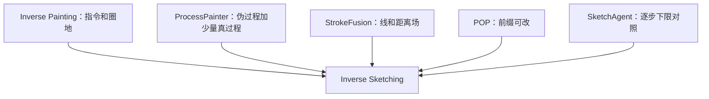

---
tags:
  - 研究
  - 组会
  - 第一轮
status: 互评已收
---

# 组会 · 第一轮

这是书面互评，不是线下开会。七位代表各写一页发言，主席按重复出现、没人反对的句子收成六条。发言原稿在 `研究/组会发言/`。

对着 [[任务定义]] 开。不读 [[PDF-Sketch]] 和两篇 PaintFlow。

入口：[[00-本轮目录]]。考卷：[[基准与SOTA]]。代表原稿一人一页，见下表。

## 投票

七位都投 **有条件赞成** Inverse Sketching。没有反对票。没有无条件赞成。

| 代表 | 发言页 | 票 | 8 周里当什么 |
| :--- | :--- | :--- | :--- |
| [[Inverse-Painting]] | [[组会发言-Inverse-Painting]] | 有条件赞成 | 骨干配方；不当现成权重基线 |
| [[ProcessPainter]] | [[组会发言-ProcessPainter]] | 有条件赞成 | 骨干（伪过程 + 少量真过程；三件任务） |
| [[StrokeFusion]] | [[组会发言-StrokeFusion]] | 有条件赞成 | 编码器骨干；不当过程基线 |
| [[Learning-to-Paint]] | [[组会发言-Learning-to-Paint]] | 有条件赞成 | 基线：证明有序下笔成立 |
| [[SketchAgent]] | [[组会发言-SketchAgent]] | 有条件赞成 | 相关工作 + 质量下限 |
| [[DiffSketcher]] | [[组会发言-DiffSketcher]] | 有条件赞成 | 相关工作；慢速线质量上限 |
| [[Primitive-Operation-Painter]] | [[组会发言-Primitive-Operation-Painter]] | 有条件赞成 | 只当相关工作；不能冒充顶会基线 |

## 主席把条件收成六条

七份发言里重复出现、没有人反对的，如下。

1. 导演和画工分开。[[Inverse-Painting]] 试过一个网络既想下一句又画下一张，会一步加太多，或层序乱掉。
2. 不要直接搬油画权重到线稿。会铺色、圈空、阶段词对不上。FID 好看也不算课堂。
3. 不要刷新 [[StrokeFusion]] 的 QuickDraw FID $17.76$。成品数字只能当附表。刷新就是和组内成品题撞车。七位里四位点名写了这一句。
4. 不要再做一个不训练的聊天画手。[[SketchAgent]] 自己说：只换提示词，审稿人会写「又一个聊天画手」。
5. 不要把 [[DiffSketcher]] Fig. 1 的 $0$、$20$、$100$ 写成构图、排线、收细。那是优化步。[[DiffSketcher]] 点名：[[ProcessPainter]] 最容易把这些帧收进伪过程。
6. 画布用线或[[距离场]]。色块停在 [[Inverse-Painting]] 和 [[Primitive-Operation-Painter]]，不是素描。

## 点名里真正打架的三处

### 顺序能不能扔

[[Inverse-Painting]]：先铺底再加高光。黄高光先出来，像素变好也算失败。若把笔画当无序集合，等于反对这篇主结论。

[[StrokeFusion]]：无序是为了五官不歪，不是说过程题不该有顺序。结构阶段可以借无序稳住位置。大形和排线不要整图无序。必须加上「现在是第几阶段」，否则骨干一用就变回 StrokeFusion。

主席裁定：结构阶段可以局部无序。整张过程必须有阶段顺序。主表看阶段，不看「无序 FID」。

### 8 帧够不够

[[ProcessPainter]]：8 帧不够当素描课。只配当阶段骨架。要么加帧，要么改成可编辑前缀。

[[Inverse-Painting]]：不要锁死 8 帧。他们平均大约 27 张关键帧。时间间隔只管加多少，不管先画哪一层。

[[Primitive-Operation-Painter]]：过程应写成可编辑前缀，不要只能改像素中间稿。

主席裁定：不抄 8 帧 RGB。阶段骨架可以短，中间用可改前缀续。

### 谁当骨干

[[ProcessPainter]] 要当骨干：伪过程 + 少量真过程，一文装文生、反推、续画。

[[Inverse-Painting]] 只认自己验证过的反过程。正过程和续画要向 ProcessPainter 借任务，不要写成 Inverse Painting 已经做了。

[[SketchAgent]]：骨干应是 Inverse Painting 的指令加区域，加上线，不是聊天。

[[Learning-to-Paint]]：自己只当基线。骨干是导演换成线。

主席裁定：方法骨干抄 Inverse Painting 的「指令 + 圈地 + 再画」。数据骨干抄 ProcessPainter 的「伪过程预训练 + 少量真过程」。表示借 StrokeFusion 的线 / 距离场。可编辑借 POP 的前缀，不当论文基线。

## 互补怎么接（代表原话收束）

- [[Learning-to-Paint]] 给伪过程当量，不当老师。像素奖励会让五官堆线。
- [[DiffSketcher]] 给「线能有多好看」的慢速对照。不当过程源。
- [[SketchAgent]] 仓库现成，证明只有逐步和插笔不够。
- [[Primitive-Operation-Painter]] 当场声明：开源项目，没有对照表，椭圆矩形不是排线。

## 失败基线（会上点名必须做的）

1. [[Inverse-Painting]] 原权重直接画线稿。代表自己写了会铺色、圈空。
2. [[SketchAgent]] 画同一对象。儿童简笔当下限。
3. [[StrokeFusion]] 打乱笔序回放。有线无过程。
4. 不要把 [[DiffSketcher]] 优化中间帧标成阶段。

## 会后题目

仍叫 Inverse Sketching。七票一致，条件见上。

正过程、反过程、中途续，一篇里能装几件，以 8 周能做完的反过程为主。另外两件能做再写，不要假装 Inverse Painting 已经覆盖。
